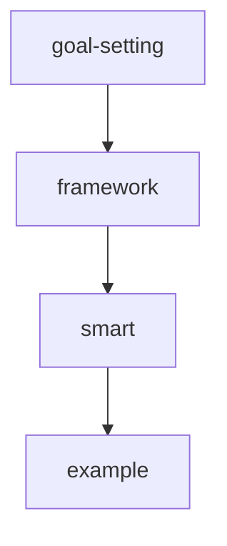
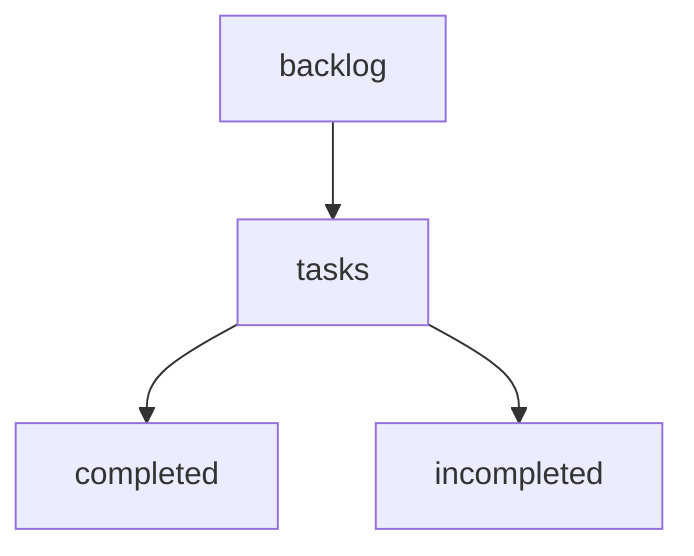
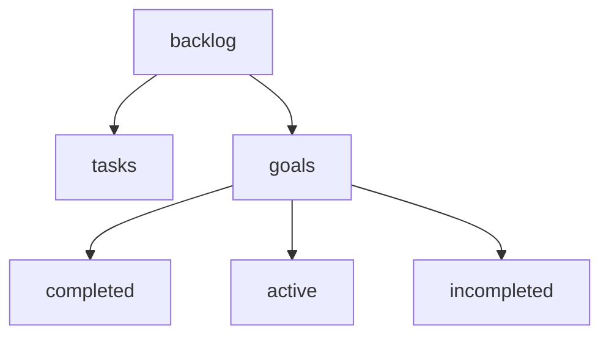

1. [x] make bash guide readable with html comments

1. [x] create artifacts to record information relevent to 
    1. [x] smart goals
        1. [x] modify goal-setting.md
        1. [x] add 
            1. [x] goal-setting.framework.smart.md
            1. [x] smart.examples.md
            1. [x] smart.template.md
        1. [x] modify
            1. [x] goal-setting.framework.smart.md
            1. [x] smart.examples.md
            1. [x] smart.template.md
    1. [x] star interview framework
        1. [x] add
            1. [x] interview.framework.star.md
            1. [x] star.examples.md
            1. [x] star.template.md
        1. [x] modify
            1. [x] interview.framework.star.md
            1. [x] star.examples.md
            1. [x] star.template.md

1. [x] refactor backlog.tasks.ongoing.md to backlog.tasks.incompleted.md
    1. [x] check changes in note graph

1. [x] add backlog.goals.
    1. [x] completed.md
    1. [x] active.md
    1. [x] incompleted.md