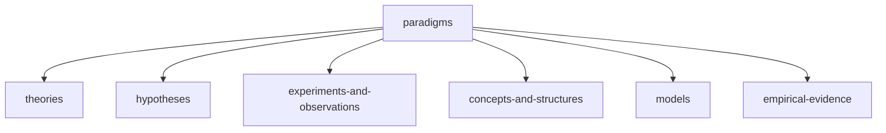

1. [ ] research different types of graph theory models
## hierarchy

```mermaid
graph TD;
    paradigms-->
    theories
    paradigms-->
    hypotheses
    paradigms-->
    experiments-and-observations
    paradigms-->
    concepts-and-structures
    paradigms-->
    models
    paradigms-->
    empirical-evidence
```