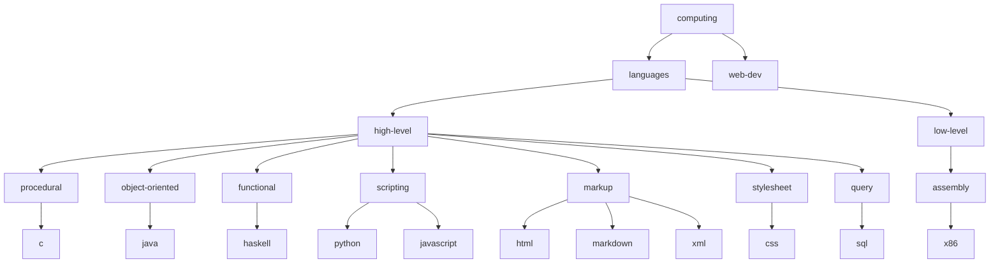

## hierarchy

1. [x] refactor computing hierarchy
    1. [x] refactor programming.languages to languages
    1. [x] add web-dev
    1. [x] add languages.low-level
    1. [x] refactor python to scripting.python
    1. [x] refactor javascript to scripting.javascript
    1. [x] add languages.high-level.
        1. [x] procedural
            1. [x] c
        1. [x] object-oriented
            1. [x] java
        1. [x] functional
            1. [x] haskell
        1. [x] markup
            1. [x] markdown
            1. [x] html
            1. [x] xml
        1. [x] stylesheet
            1. [x] css
        1. [x] query
            1. [x] sql
    1. [x] add languages.low-level.
        1. [x] assembly
            1. [x] x86
1. [x] 18.md
    1. [x] move
    1. [x] commit