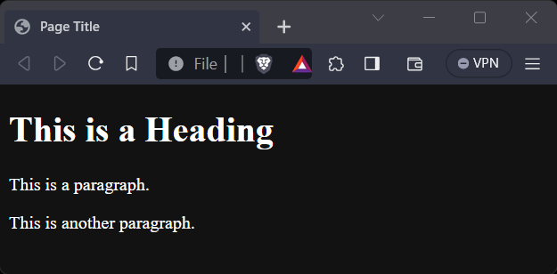

<!-- start of 'template' section -->
<details>
    <summary>Template</summary>

#
Here is the basic template of an HTML file.

### Input
```html
<!DOCTYPE html>
<html>
    <head>
        <title>Page Title</title>
    </head>
    <body>
        <h1>This is a Heading</h1>
        <p>This is a paragraph.</p>
        <p>This is another paragraph.</p>
    </body>
</html>
```

### Output
>


---
</details>
<!-- end of 'template' section -->


<!-- start of 'link css file' section -->
<details>
    <summary>Link CSS File</summary>

#
To link a CSS file to an HTML file, you use the `link` tag in the `head` section of the HTML file. The rel attribute specifies the relationship between the HTML and the linked file, the type attribute specifies the MIME type, and the href attribute provides the URL of the linked file.

### Input
```html
<link rel="stylesheet" type="text/css" href="styles.css">
```

In this example, styles.css is in the same directory as the HTML file. If it's in a different directory, you would need to adjust the href attribute to point to the correct location.

---
</details>
<!-- end of 'link css file' section -->