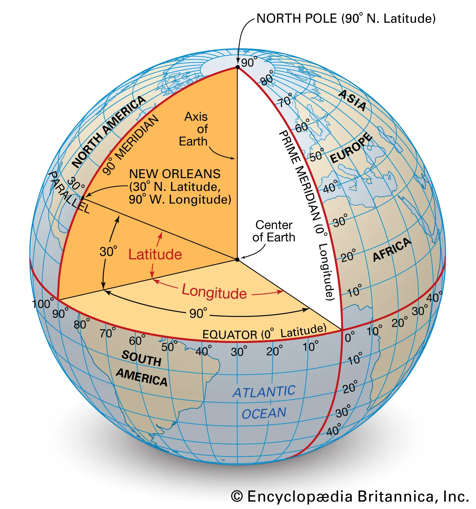

The Geolocation API is a powerful browser feature used `to obtain` **the** `geographical position` (`latitude` `and` `longitude`) `of` **a** `user's device`. **As long as the user grants permission**, this API can be very **useful for** a variety of web applications, such as `enhancing` `local search results`, `providing directions`, **or** `automatically setting location preferences`. Here’s a brief guide on how to use the Geolocation API in JavaScript:




<!-- start of 'geolocation' section -->
<details>
    <summary>Definition: geolocation</summary>

#
Geolocation **refers to the** `process of` `determining or` `estimating` **the** `real-world` `geographic location of` **an** `object or` `person` `based on` `digital information` **such as** `GPS coordinates`, `IP addresses`, **or** `other` **data collected by location-sensing technologies**.

---
</details>
<!-- end of 'geolocation' section -->


<!-- start of 'real-world' section -->
<details>
    <summary>Definition: real-world</summary>

#
The term "real-world" **refers to the** `actual` `physical world` `where human beings` `live and` `interact`, **as opposed to virtual**, **digital**, **or imagined environments**.

---
</details>
<!-- end of 'real-world' section -->


<!-- start of 'geographic' section -->
<details>
    <summary>Definition: geographic</summary>

#
"Geographic" **refers to** `anything` `related to` **the** `Earth's surface`, **including its** `features`, `locations`, **and** `how areas are` `mapped` **and** `studied`.

---
</details>
<!-- end of 'geographic' section -->


<!-- start of 'gps' section -->
<details>
    <summary>Definition: gps</summary>

#
GPS (`Global Positioning System`) **is a** `satellite-based` `navigation system` **that provides** `location` `and` `time` `information` `anywhere on` `or near` **the** `Earth where` `there is` **an** `unobstructed` `line of sight to` `four or more` `GPS satellites`.

---
</details>
<!-- end of 'gps' section -->

 

<!-- start of 'obtain' section -->
<details>
    <summary>Definition: obtain</summary>

#
To "obtain" **means to** `acquire or` `get something`, **usually** `through effort or` **a** `specific process`.

---
</details>
<!-- end of 'obtain' section -->


<!-- start of 'geographical' section -->
<details>
    <summary>Definition: geographical</summary>

#
"Geographical" **refers to** `anything` `related to` **the** `study or` `features of` **the** `Earth's surface`, **including** `locations`, `physical features`, **and** `how` `they are` `mapped`.

---
</details>
<!-- end of 'geographical' section -->


<!-- start of 'latitude' section -->
<details>
    <summary>Definition: latitude</summary>

#
Latitude **is a** `measurement` **used** `to indicate` **the** `location of` **a** `place on` `Earth` `north or` `south of` **the** `equator`, `expressed in` `degrees`.

---
</details>
<!-- end of 'latitude' section -->


<!-- start of 'equator' section -->
<details>
    <summary>Definition: equator</summary>

#
The equator **is an** `imaginary line` `around` **the** `middle of` **the** `Earth` **that is** `equidistant from` **the** `North and` `South Poles` **and** `divides` **the** `Earth into` **the** `Northern and` `Southern Hemispheres`.

---
</details>
<!-- end of 'equator' section -->


<!-- start of 'equidistant' section -->
<details>
    <summary>Definition: equidistant</summary>

#
Equidistant **means** `being at` **the** `same` `distance from` `two or more` `points`.

---
</details>
<!-- end of 'equidistant' section -->


<!-- start of 'hemisphere' section -->
<details>
    <summary>Definition: hemisphere</summary>

#
A hemisphere **is** `half of` **the** `Earth`, **usually divided into northern and southern halves by the equator**, **or into eastern and western halves by a meridian**.

---
</details>
<!-- end of 'hemisphere' section -->


<!-- start of 'meridian' section -->
<details>
    <summary>Definition: meridian</summary>

#
A meridian **is an** `imaginary` `line on` **the** `Earth` **that** `runs from` **the** `North Pole to` **the** `South Pole`, **used** `to measure` `longitude`.

---
</details>
<!-- end of 'meridian' section -->


<!-- start of 'longitude' section -->
<details>
    <summary>Definition: longitude</summary>

#
Longitude **is a** `measurement` **used** `to indicate` **the** `location of` **a** `place on` `Earth` `east or west of` **the** `Prime Meridian`, `expressed in` `degrees`.

---
</details>
<!-- end of 'longitude' section -->


### Basic Concepts

The **Geolocation API is accessed through the** `navigator.geolocation` `object` **provided by the browser's JavaScript environment**. It **mainly offers** `three methods`:

1. **`getCurrentPosition(success, error, options)`**: `Retrieves` **the device's** `current location`.
2. **`watchPosition(success, error, options)`**: `Registers` **a** `handler` **that will be** `called automatically` `every time` **the** `position changes`.
3. **`clearWatch(watchId)`**: `Unregisters` `handlers` **set up with 'watchPosition'**.

### Usage

#### Checking for Support

`Before using` the `Geolocation API`, **you should** `check if` **it is** `supported by` **the** `user's browser`:

```javascript
// Check if the Geolocation API is available in the navigator object
if ("geolocation" in navigator) {
  // Geolocation API is supported
  // You can now call navigator.geolocation methods here
} else {
  // Geolocation API is not supported by the browser
  // Alert the user that their browser does not support this feature
  alert("Geolocation is not supported by your browser");
}
```

#### Getting the Current Position

To get the current location once, you **use** `getCurrentPosition()`. This **method is** `asynchronous` **and** `requires` `callback functions` `to handle` **the** `success or` `failure of` **the** `data retrieval`:

```javascript
// Define success callback function
function success(position) {
  // Extract latitude and longitude from the position object
  const latitude = position.coords.latitude;
  const longitude = position.coords.longitude;
  // Log the latitude and longitude to the console
  console.log(`Latitude: ${latitude}, Longitude: ${longitude}`);
}

// Define error callback function
function error(err) {
  // Log any errors that occur during the process to console
  console.error(`Error occurred: ${err.message}`);
}

// Request the current geographical position of the device
navigator.geolocation.getCurrentPosition(success, error);
// Provide the success and error functions as callbacks
```

#### Watching Position Changes

If you need `to track` `location changes` (for a **live location feature in an app**), **use** `watchPosition()`:

```javascript
// Start watching user's location changes continuously
const watchID = navigator.geolocation.watchPosition(success, error);
// 'success' and 'error' callback functions; to handle location data or errors respectively

// 'clearWatch' method to stop watching user's location
navigator.geolocation.clearWatch(watchID);
// Can be triggered by some user action or condition in application
```

### Options

**Both** `getCurrentPosition()` **and** `watchPosition()` `accept` **an optional** `third parameter for` `configuring` **the** `behavior` **of the API**:

```javascript
// Define options for geolocation request
const options = {

  // Request high accuracy for the position which might use GPS and consume more battery
  enableHighAccuracy: true,

  // Maximum time allowed to try getting a position in milliseconds
  timeout: 5000,
  // If the position is not obtained within this time, the error callback is triggered
  
  // Maximum age of a cached position that is acceptable to return in milliseconds
  maximumAge: 60000
  // If a cached position exists and is younger than this age, it may be returned instead of fetching a new position
};

// Request current geographical position of device
navigator.geolocation.getCurrentPosition(success, error, options);
// 'success' and 'error' callback functions; to handle location data or errors respectively
// 'options' is an object containing options for the request as defined above
```

### Privacy Considerations

It's `important to` `handle` **the** `Geolocation API` `with care` `due to` `privacy concerns`:
- `Always` `request permission` `from` **the** `user` `before` `attempting to` `access` **their** `location`.
- `Explain` `why` `you need` **the** `location data`.
- `Ensure` **that** `location data is` `transmitted and` `stored securely` **if necessary**.

### Browser Support

The `Geolocation API` **is** `widely supported` in all modern browsers, but `how it` `determines location` (**GPS**, **Wi-Fi**, **cellular networks**, **IP address**) `can vary` **significantly** `between` `devices` **and** `browsers`.

`By utilizing` **the Geolocation API** `responsibly` **and** `effectively`, **developers** `can create` `more interactive` `and personalized` `experiences for` **web** `users`.