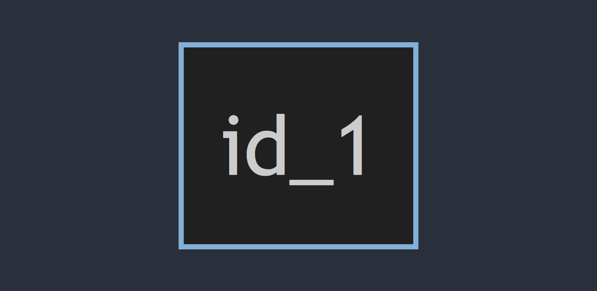
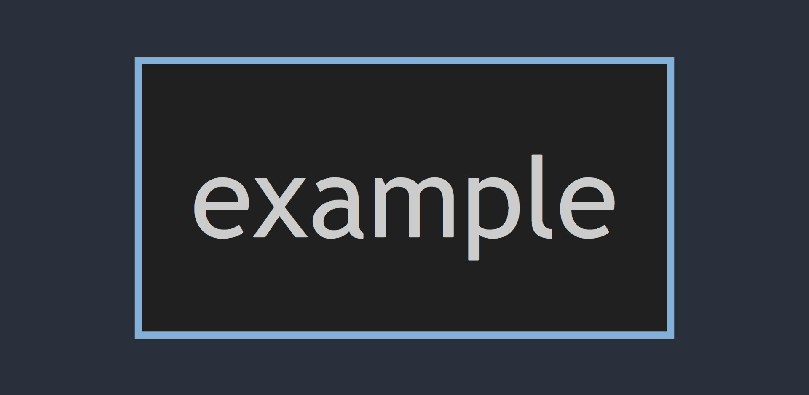
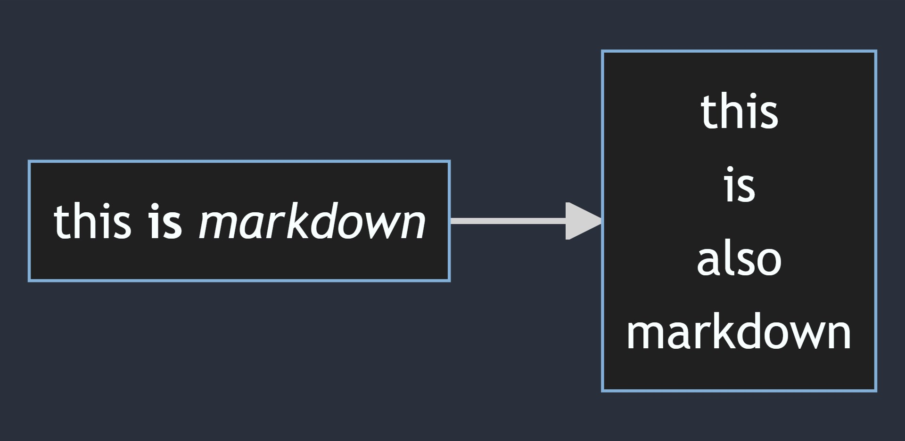

Flowcharts are composed of nodes (geometric shapes) and edges (arrows or lines). The Mermaid code defines how nodes and edges are made and accommodates different arrow types, multi-directional arrows, and any linking to and from subgraphs.


<!-- start of 'node' section. -->
<details>
    <summary>Node</summary>

#
The id is what is displayed in the box.

### Input

```
flowchart LR
    id_1
```

### Output

>


---
</details>
<!-- end of 'node' section. -->


<!-- start of 'node with text' section. -->
<details>
    <summary>Node with Text</summary>

#
It is also possible to set text in the box that differs from the id. If this is done several times, it is the last text found for the node that will be used. Also if you define edges for the node later on, you can omit text definitions. The one previously defined will be used when rendering the box.

### Input

```
flowchart LR
    id_1[example]
```

### Output
>


---
</details>
<!-- end of 'node with text' section. -->


<!-- start of 'example' section. -->
<details>
    <summary>example</summary>

#
Description

### Input

```
flowchart LR
    id_1["`this **is** _markdown_`"]

    id_2["`
    this
    is
    also
    markdown
    `"]

id_1 --> id_2
```

### Output
>


---
</details>
<!-- end of 'example' section. -->


<!-- start of 'markdown formatting' section. -->
<details>
    <summary>Markdown Formatting</summary>

#
Description

### Input

```
flowchart LR
    id_1["`this **is** _markdown_`"]

    id_2["`
    this
    is
    also
    markdown
    `"]

id_1 --> id_2
```

### Output
>


---
</details>
<!-- end of 'markdown formatting' section. -->


<!-- start of 'example' section. -->
<details>
    <summary>Markdown Formatting</summary>

#
This statement declares the direction of the Flowchart.

### Input

This declares the flowchart is oriented from left to right.

```
flowchart LR
    id_1[from left] --> id_2[to right]
```

### Output
>
output

### Input

This declares the flowchart is oriented from top to bottom.

```
flowchart TB
    id_1[from top] --> id_2[to bottom]
```

### Output
>
output

---
</details>
<!-- end of 'example' section. -->
