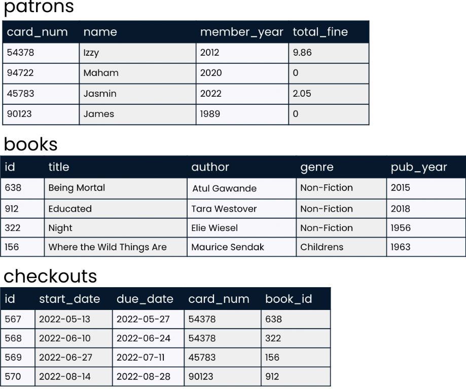
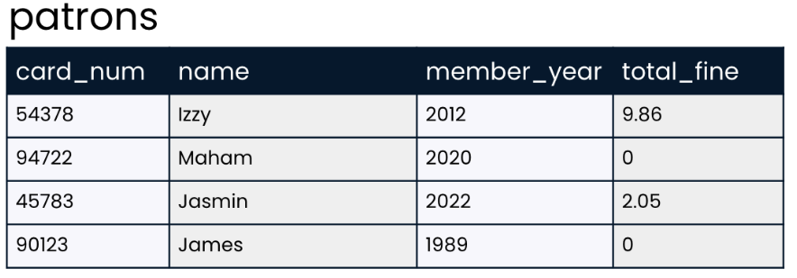
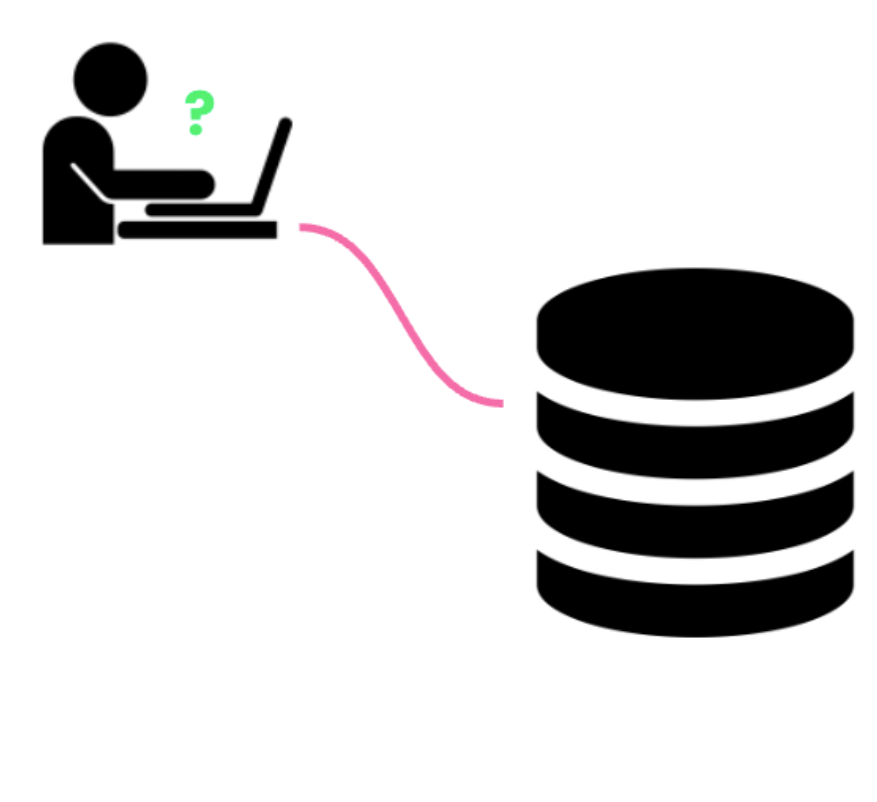
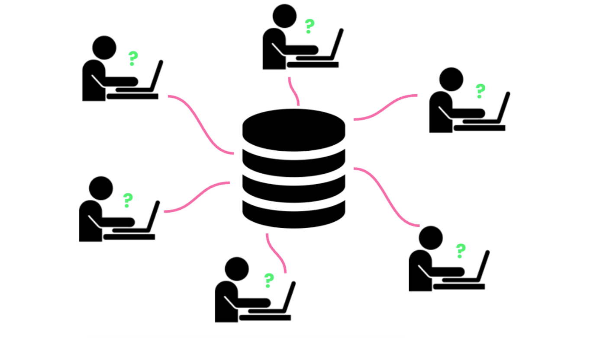

## Introduction 

A database `stores data`. Let's imagine that we are in charge of storing and organizing data for a library. We might set up a database that `holds information such as` the data pictured here on `patrons`, `books`, and `checkouts`. This information is `housed in objects` called `tables`, with data `organized` into `rows` and `columns`. This database contains a patrons table, a books table, and a checkouts table.

A closer look at the `patrons table shows` that it stores various data about our library's patrons, like `library card number`, `name`, the `year` the patron `became a library member`, and the `total overdue fines` the patron owes our library.

## Relational Databases

A `relational database` defines `relationships between seperate tables` of data `inside` the `database`. For `example`, each of our library `patrons` might each be `associated with several checkouts`. Through these `relationships`, we `can draw conclusions` about data housed in separate tables in the same database, and `answer questions` such as `"Which books did James check out during 2022?"` or `"Which books are checked out most often?"`

## Database Advantages

These tables might `look similar to` the way data is organized in `spreadsheet applications` such as `Excel` or `Google Sheets`, `but databases` are far `more powerful` than spreadsheets. Databases can `store much more data`, and storage is more `secure due to encryption`.

Possibly the biggest advantage of a database is that `many users can write queries to gather insights from the data at the same time`. `When` a database is `queried`, the `data stored` inside the database `does not change`: rather, the database `information is accessed and presented according to instructions in the query`.

<!-- start of 'query' section -->

    
Definition: Query

#
A query is a `request for data or information` from a database. It usually `involves specifying` certain criteria (`conditions`) that `the data must meet`.

---

<!-- end of 'query' section -->

#

## SQL

Short for `Structured Query Language`. It is the `most` widely `used programming language for creating, querying, and updating relational databases`. Once we are familiar with the data we have and which table it is stored on, we can use SQL to begin writing queries to answer questions about our library -- more on that in Chapter Two.

