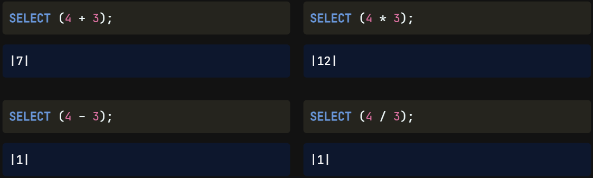
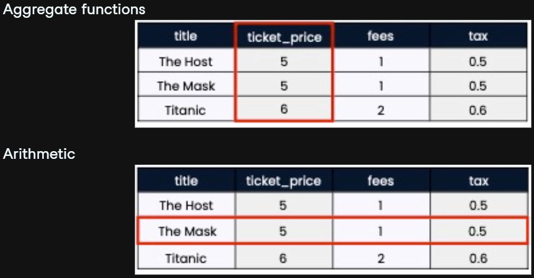
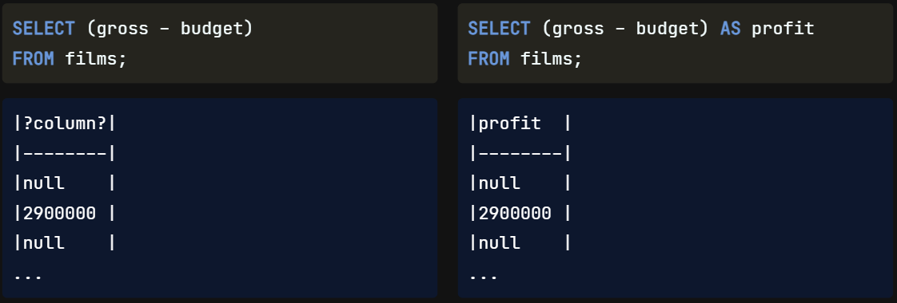
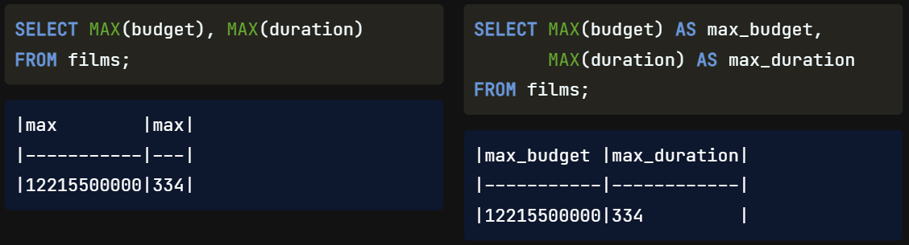
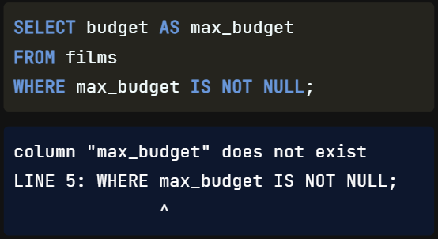

Welcome back! In this lesson, we will learn about using more arithmetic in our queries and take a closer look at `aliasing` **with** `AS`.

## Arithmetic

We can `perform` basic arithmetic **with** `symbols` **like** `plus`, `minus`, `multiply`, **and** `divide`. Using `parentheses` with arithmetic **indicates** to the processor `when` the `calculation needs to execute`. Here are some basic examples of how we can use arithmetic in SQL. We can add, subtract, multiply, and divide as follows. In these examples, the `parentheses` are `not required` **as** `only one` `calculation` **takes place**; `however`, **they** `provide` **more** `clarity` to the code. But, the division gives a result of one; why is that?

`Similar to other programming languages`, **SQL** `assumes` **that we want to get an** `integer` **back** `if` **we** `divide` **an** `integer by` **an** `integer`. So be careful! When dividing, we can **add** `decimal places` to our numbers if we want **more** `precision`. For example, SELECT four-point-zero divided by three-point-zero gives us the result we would expect: 1-point-3 repeating.

## Aggregate functions vs. Arithmetic

What's the `difference` **between** using `aggregate functions` **and** `arithmetic`? The key difference is that `aggregate functions`, like SUM, **perform their operations on the fields** `vertically` while `arithmetic` **adds up the records** `horizontally`.

## Aliasing with Arithmetic

Before we move on, let's run through an arithmetic **example** using our database. Here we have selected the `gross`, how much the movie made, `minus` the `budget`, how much the movie cost, from our films table. The **result is** the amount of `profit`. Notice that the `query's result` `doesn't give` us a `defined field name`. We will `always` need to `use` an `alias` **when** `summarizing data` **with** `aggregate functions` **and** `arithmetic`.

## Aliasing with Functions

As we progress and learn how to manipulate our data, it will be even more `important` **to** `keep` our `field names` `clear`. For **example**, if we're using `multiple` `MAX functions` **in** `one query`, **we'll have** `two fields named` `max`, which isn't very useful! This is a situation when it's especially `important` **to** `alias` like we do here.

## Order of Execution

Let's explore `how` using an `alias` `fits into` the **SQL** `execution order`. Here is a reminder of the order of execution we know so far: SQL will process the `FROM` statement first, followed by the `WHERE` clause, then the `SELECT` statement, and finally, `LIMIT`. When `adding` an `alias` for a field name **in** the `SELECT` clause, **we might assume we could use it later in our query with the WHERE clause**. Unfortunately, **that is not possible**; as we can see by the order of execution, **the query would not have created the alias yet**, and our code would generate an **error**.

