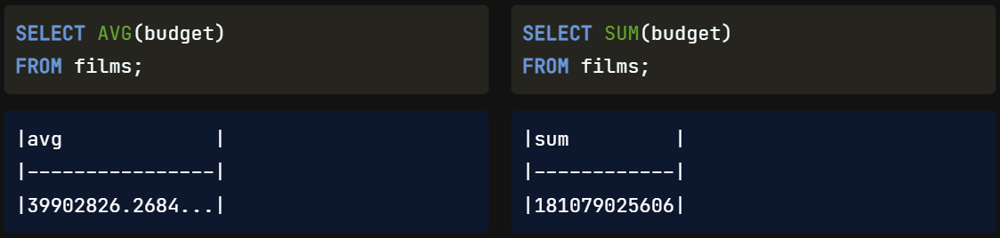
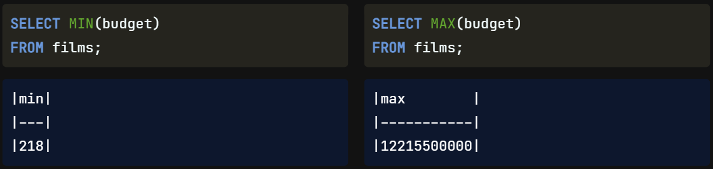
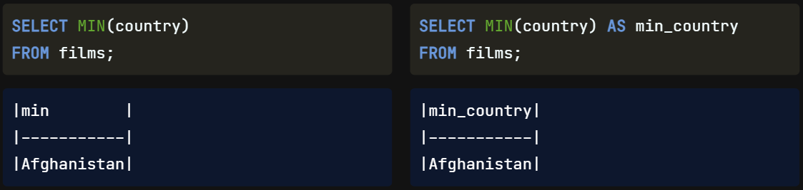

Fantastic job getting this far! Let's learn about summarizing data **with** aggregate functions.

When analyzing data, we often want to understand the dataset as a whole in addition to looking at individual records. One way to do this is to summarize the data using SQL's aggregate functions. An aggregate function performs a calculation on several values and returns a single value.

## Aggregate functions

We already know one aggregate function, COUNT()! We'll now learn four new aggregate functions, allowing us to find the average, sum, minimum, and maximum of a specified field. Let's look at some examples of how they work. These aggregate functions come after SELECT, exactly like COUNT(). This first query gives us the average value from the budget field of the films table. That's an average of over 39 million per film in the films table. The SUM() function returns the result of adding the values in the budget field. Here, the total budget of all the films is over 181 billion!

The MIN() function returns the lowest budget, and the MAX() function returns the highest budget. The 2006 South Korean movie "The Host" had a budget of over 12 billion. That sounds huge, but our data is in multiple currencies, so a true comparison would require currency exchange rates as well. Note that we operate on the field (or column) with all of these aggregate functions, not the records (or rows).

## Non-numerical data

Although these functions appear to be mathematical, we can use several of them with both numerical and non-numerical fields. Average and sum are the two aggregate functions we can only use on numerical fields since they require arithmetic. We can use count, minimum, and maximum with non-numerical fields as we already saw with COUNT() in previous lessons.

Numerical Only|Both
---|---
AVG|COUNT
SUM|MIN
|  |MAX

#
COUNT() can provide a total of any non-missing, or not null, records in a field regardless of their type. Similarly, minimum and maximum will give the record that is figuratively the lowest or highest. Lowest can mean the letter A when dealing with strings or the earliest date when dealing with dates. And, of course, with numbers, it is the highest or the lowest number.

Here are some examples of using these functions with non-numerical fields. We can select the minimum and maximum country from the films database and see that our minimum country, or country that would come first in the alphabet, is Afghanistan. In contrast, West Germany is the maximum country that would come last in the alphabet. Our database does not contain any films made in Zambia or Zimbabwe, but it does have at least one film made back when Germany was two different countries!

## Aliasing when summarizing

Notice how all query results have automatically updated the field name to the function. In this case, min. It's best practice to use an alias when summarizing data so that our results are clear to anyone reading our code.

