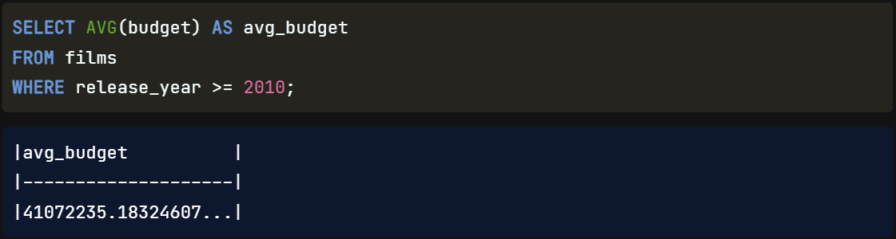
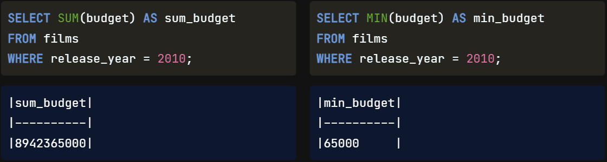

Well done! Now we will `combine` our `filtering` skills **with** our new `summarizing` skills.

## WHERE with Aggregate Functions

We can combine aggregate functions with the WHERE clause **to** `gain` further `insights` **from** our `data`. That's because the `WHERE` clause `executes before` the `SELECT` statement. For example, to get the average budget of movies made in 2010 or later, we would select the average of the budget field from the films table where the release year is greater than or equal to 2010.

Here are a few more examples using the other functions: we find the total budget of movies made in 2010 using the SUM function, that's over 8.9 billion! Next, we get the smallest budget using the MIN function, which is 65,000.

Here, we query the highest budget using the MAX function. `600 million` feels like `a lot` again `for` **a** `movie budget`, `but` **this is in** `Indian Rupees` for the movie "Kites". Finally, we query the count of the number of budgets using the `COUNT` function, which gives us the `total number` **of** `non-missing values` in the budget field, meaning there are 194 budgets recorded for the year 2010 in the films table.

## ROUND()

Now that we are doing all sorts of things with our numerical values, we'll `likely` want to `clean up` some of the crazy `decimals` that might appear. In SQL, we can use `ROUND()` **to** `round` our `number` **to** a **specified** `decimal`. There are `two parameters` **for** `ROUND()`: the `number` we want to round **and** the `decimal place` we want to round to. Here we have re-calculated the same average budget as before, but this time we have included ROUND() and specified we want to round to `two decimal places` because we are **dealing with** `currency`.

## ROUND() to a Whole Number

The `second parameter` in our ROUND() function **is** `optional`, so we can `leave it out` if we want **to round to a** `whole number`. We would get the `same result` if we passed `zero` **as** the `second argument`, as it is the `default` **when** `no number` **is** `given`.

## ROUND() using a Negative Parameter

Here is a `tricky one`: we could also pass a `negative number` **as** the `second parameter` **and** `still get` a `result`. Here, the function is `rounding` **to** the `left` **of** the `decimal point` `instead of` the `right`. Using `negative five` as the decimal place parameter will cause the function to round to the hundred thousand or `five places` **to the** `left`. `ROUND()` can `only` be used **with** `numerical` **fields**.

