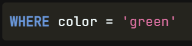
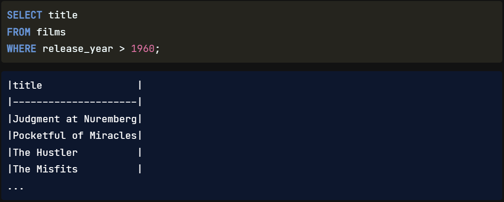
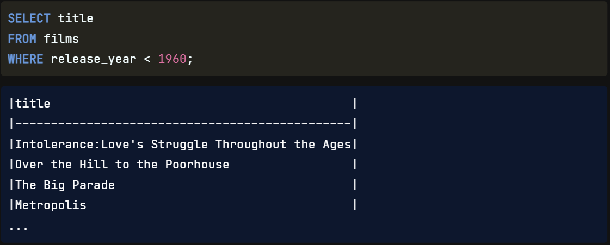
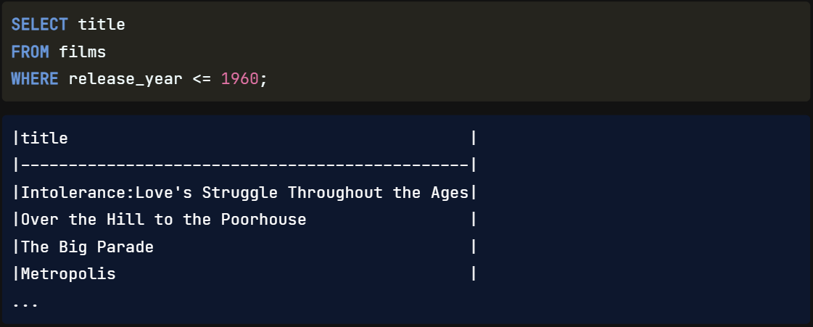
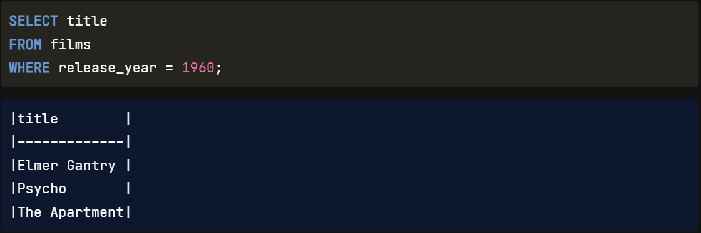
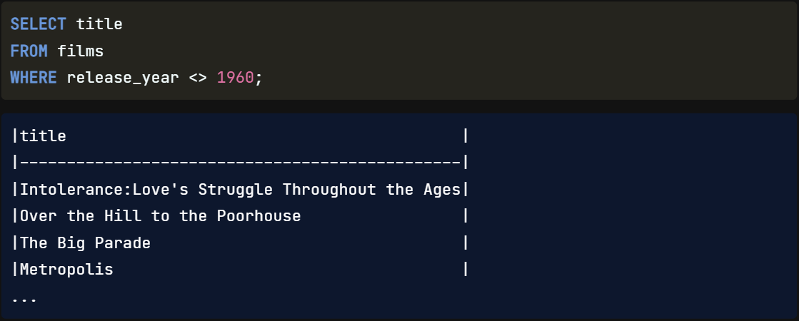
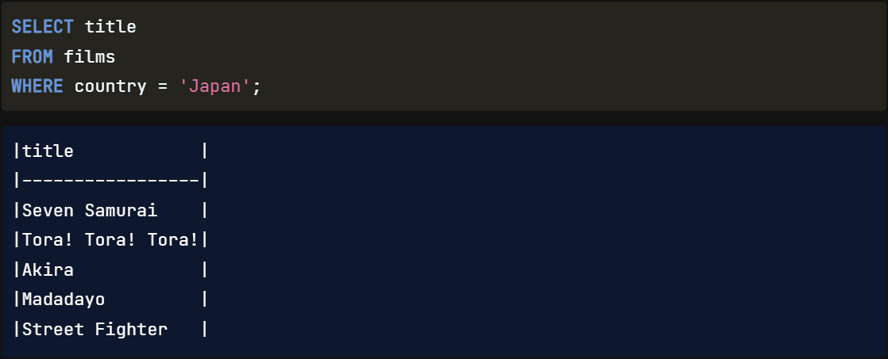

## WHERE

`To filter`, we need to `use` a new `clause` called `WHERE`, which allows us `to focus on only the data relevant to` our `business questions`. Going back to our coat analogy, we may want to `select` a `coat from` the `closet where` the `color is green`. The WHERE clause can help us with that.

## WHERE with Operators

### Greater-than '>'
We will focus on `filtering numbers` in this lesson. To do this, we will be using `comparison operators` such as `greater than`. Here is an example of a query `where` we filtered to see only `films released after` the year `1960` using the greater than operator.

### Less-than '<'
Let's explore some of the other operators. We would use the less-than operator to see `films released before` the year `1960`.

### Less-than or Equal to '<='
We would use the less than or equal to operator to see `films released during or before` the year `1960`.

### Greater-than or Equal to '>='

### Equal to '='
If we want to see `films released in a specific year`, we can use equals.

### Not Equal to '<>'
Here is a final example that isn't as intuitive as the others. If we wanted to filter films to see `all releases EXCEPT` those from the `year 1960`, we would `combine` the `less than and greater than symbols` as shown here. This is the `SQL standard symbol` that means "`not equal to`".

## WHERE with Strings

WHERE and the comparison operator, `equals`, can also be `used with strings`. In these cases, we will have to use `single quotation marks` around the `strings` we want `to filter`. For example, here, we want to filter titles where the country is Japan.

## Order of Execution

A final note on using WHERE. Similar to LIMIT, this clause comes after the FROM statement when writing a query. If we use both WHERE and LIMIT, the written order will be SELECT, FROM, WHERE, LIMIT; however, the order of execution will now be FROM, WHERE, SELECT, LIMIT. Thinking about the coats in our closet, we go to the closet we want to get the coat `from`, find `where` the green coats are, and `select five` of them.

Written Order | Execution Order
---|---
**SELECT** | `FROM`
**FROM** | `WHERE`
**WHERE** | `SELECT`
**LIMIT** | LIMIT