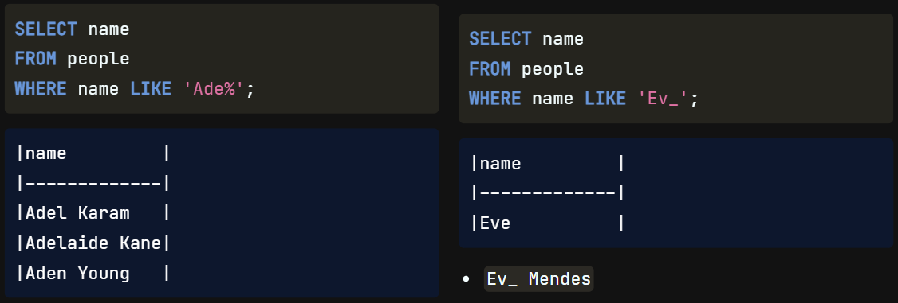
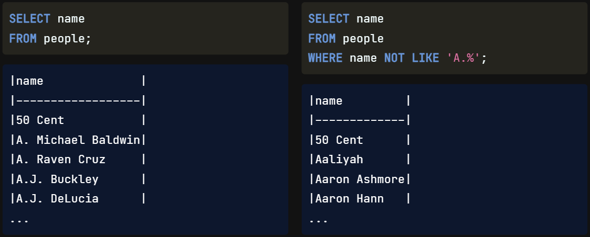
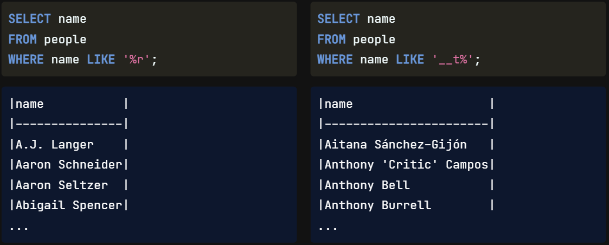
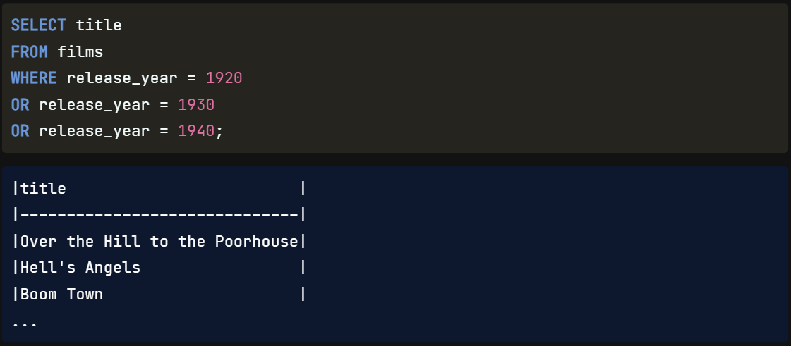
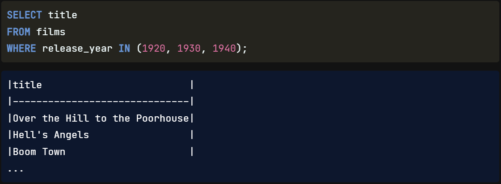
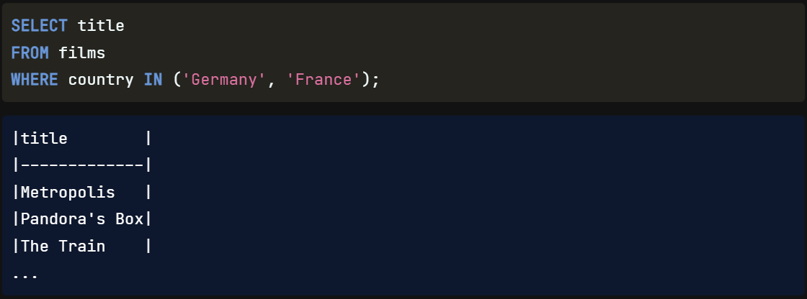

We're making excellent progress! We will now switch our focus away from filtering numbers to filtering `textual data`.

As we've briefly seen, we can use the WHERE clause to filter text data. However, **so far, we've only been able to filter by specifying the exact text we're interested in**.

We'll **often** want to `search` **for** a `pattern` rather than a specific text string in the real world. We'll be introducing `three` more SQL `keywords` into our vocabulary to help us achieve this: `LIKE`, `NOT LIKE`, **and** `IN`.

## LIKE

In SQL, we can use the `LIKE` operator **with** a `WHERE` clause **to** `search` **for** a `pattern` **in a** `field`. We use a `wildcard` **as** a `placeholder` **for some** `other values` to accomplish this. There are `two wildcards` with LIKE, the `percent`, **and** the `underscore`. The `percent` wildcard **will match** `zero`, `one`, **or** `many characters` **in the** `text`. For example, the query on the left matches people like Adel, Adelaide, and Aden. The `underscore` wildcard **will match a** `single character`. For example, the query on the right matches only three-letter names like Eve. We'd also see names like Eva if it were in our dataset. `Eva Mendes`, however, **would** `not` **be** `visible` `unless` the `search criteria` **looked like** `this`.

## NOT LIKE

We can also use the `NOT LIKE` operator **to** `find` `records` **that** `don't match` **the specified** `pattern`. In this query, we are finding records for people who do not have A-dot as part of their first name. It's important to note that this operation is `case-sensitive`, so we must be mindful of what we are querying.

## Wildcard Position 

We've reviewed one example of where to position each wildcard, but **we can** actually `place` them `anywhere` **and** `combine` **wildcards**! We can `find values` **that** `start`, `end`, **or** `contain characters` **in** `any position`, **as well as** `find records` **of a** `certain length`. For example, this **code on the left will find all people whose name** `ends in r`. The **code on the right will find records where the** `third character is t`.

## WHERE, OR

**What if we want to** `filter` **based on** `many conditions` **or a** `range` **of** `numbers`? **We could** `chain` **several** `ORs` **to** the `WHERE` clause based on what we know, `but` **that can get** `messy`. We can see an example here where we select the film titles released in 1920, 1930, or 1940.

## WHERE, IN

A helpful operator here is IN. The `IN` **operator** `allows` **us to** `specify` `multiple values` **in** a `WHERE` clause, making it `easier` **and** `quicker` **to** `set` **numerous** `OR conditions`. Neat, right? So, the example shown on the previous slide would simply become WHERE release_year IN 1920, 1930, 1940, where the years **are** `enclosed` **in** `parentheses`.

Here is **another** `example` **using a** `text` **field** where we want to find the title WHERE the associated country is either Germany or France.

