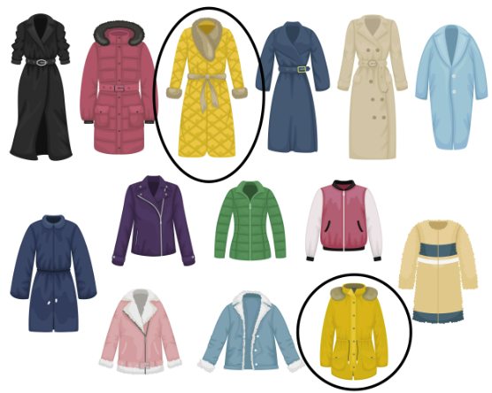

Great work on filtering numbers! Our SQL skills are growing fast. Next up, we will look at how to `filter` **with** `multiple criteria`.

There will `often` be `the case` that we have more than one criteria we'd like to meet. Looking again at our favorite coats, perhaps we want `narrow down` **our** `choices` to coats 

that are yellow 

and shorter in length.

We will be learning about `three` **additional** `keywords` that **will** `allow` **us to** `enhance` **our** `filters` **when** `using WHERE` by adding multiple criteria. These are `OR`, `AND`, **and** `BETWEEN`. In the context of our coats, we could look at coats **where** the `color` **is** `yellow` **or** the `length` **is** `short`, **or** we could `filter` for coats **where** `both` **criteria are** `true`. We can also look for coats that have **between** `one` **and** `five buttons`.

## OR

The first keyword we will look at is the OR operator. OR is `used` when we want **to** `filter multiple criteria` **and** only need **to** `satisfy` **at least** `one condition`. Perhaps we want to select green or purple coat options as an example.

In SQL, we `combine` `OR` **with** `WHERE` to achieve this type of filtering. Here is an example using the films database. The query on the left returns all films released in either 1994 or 2000. Note that we must `specify` the `field` **for every** `OR condition`, so the `query` **on** the `right` **is** `invalid`. That query `hasn't specified` what `field` **or** `operator` should be `associated` **with the year** `2000`.

## AND

If we want **to** `satisfy all criteria` **in our** `filter`, we need to **use** `AND` **with** `WHERE`. For example, this query gives us the titles of films released between 1994 and 2000. We need to `specify` the `field name separately` **for every** `AND` `condition` as with OR.

## AND, OR

Let's kick it up a notch. We now want to filter films released in 1994 OR 1995, AND with a certification of either PG or R. Thankfully, we can **combine** `AND` **and** `OR` to answer this question. **If a** `query` **has** `multiple filtering conditions`, **we** will **need to** `enclose` the `individual clauses` **in** `parentheses` **to** `ensure` the `correct execution order`; otherwise, we may not get the expected results.

## BETWEEN, AND

As we've learned, we can use this query to get titles of all films released in and between 1994 and 2000. Checking for ranges like this is very common, so in SQL the `BETWEEN` keyword provides a valuable shorthand **for** `filtering values` **within a** specified `range`. This `second query` **is** `equivalent` **to** the one on the `left`. It's important to remember that `BETWEEN` **is** `inclusive`, **meaning** the `results` **contain** the `beginning` **and** `end` `values`.

## BETWEEN, AND, OR

Like the WHERE clause, the `BETWEEN` clause **can be used with** `multiple` `AND` **and** `OR` `operators`, so we can build up our queries and make them even more powerful! For example, we can get the titles of all films released between 1994 and 2000 from the United Kingdom.

