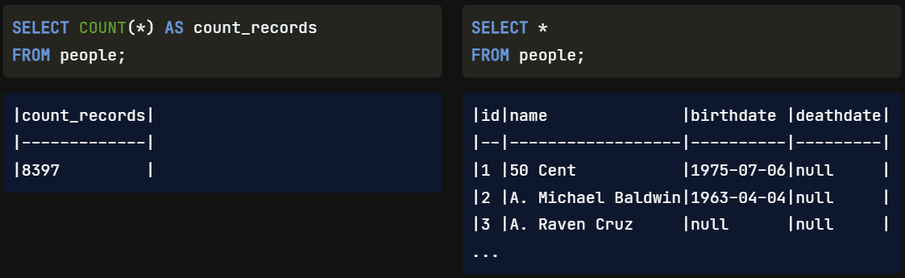
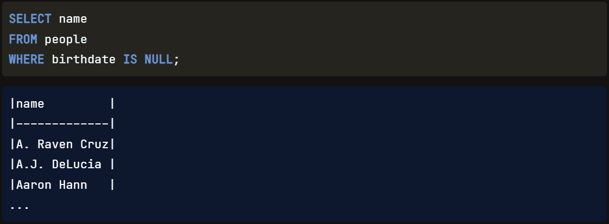
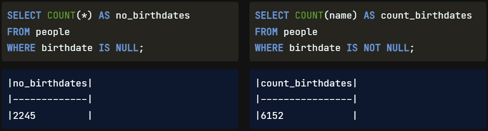
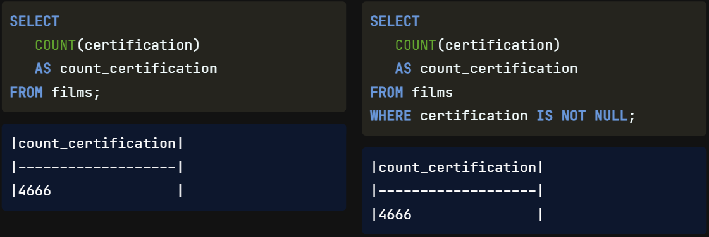

Our next lesson will review how to `filter data` **that includes** `NULL values`.

## Missing Values

What is a missing or non-missing value? In SQL, `NULL` **represents a** `missing` **or** `unknown value`. Why is this useful? In the real world, our `databases` **will** `likely` **have** `empty fields` either **because of** `human error` **or** because the `information` **is** `not available` **or** is `unknown`. Knowing how to handle these fields is essential as they can `affect` any `analyses` we do.

## NULL

For example, we used COUNT all with an asterisk on the left. Suppose our goal is to analyze posthumous success using data from the people table. We **might make the** `wrong assumption` **that because we have a field name called deathdate**, this `information` **is** `available` **for** `everyone`. `Half` of them **are**, in fact, `NULL`, as we can see on the right, so we **would make an** `inaccurate judgment` **on** what the `data` means.

## IS NULL

**To see** `how much` of our `data` **is** `missing` we can use `IS NULL` **with** the `WHERE` clause. Here is an example where we have checked to see **which names do not have a recorded birthdate** in our table.

## IS NOT NULL

On the left is an example of counting the missing birthdates in the people table. The count is 2245. Sometimes, we'll want **to** `filter out` `missing values`, so we only get results that are not NULL. To do this, we can use the IS NOT NULL operator. For example, this query on the right gives the count of all people whose birth dates are not missing in the people table, giving us a new count of 6152.

## COUNT() vs IS NOT NULL

There may be a question about the difference between using COUNT with a field name and using the same COUNT with the added WHERE clause with IS NOT NULL. The answer is there is `no difference`, **as** `both` **will be** `counting` `non-missing values`.

#
Before we wrap up this lesson, let's review what we've learned. `NULL values` are missing values, and they are **very** `common` in the real world. It is `good practice` **to** `know` `how many` `NULL values` are **in** our `data` by using the IS NULL or IS NOT NULL operator for filtering. **These keywords** will `help` **to** `identify`, `select`, **or** `exclude` `missing values`. Don't worry; this **will** soon **become** `second nature` because it is that common!