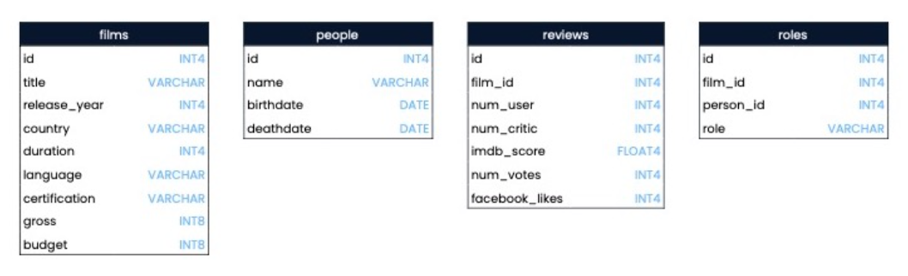
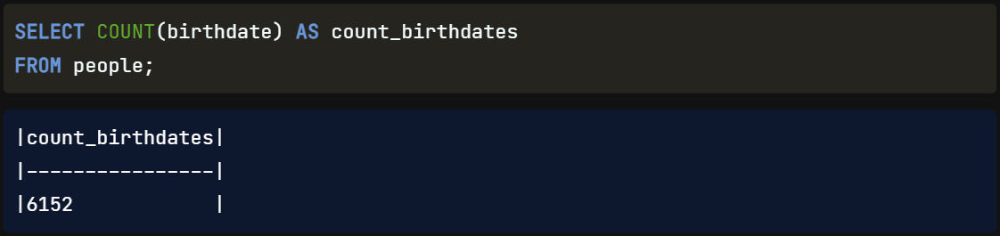
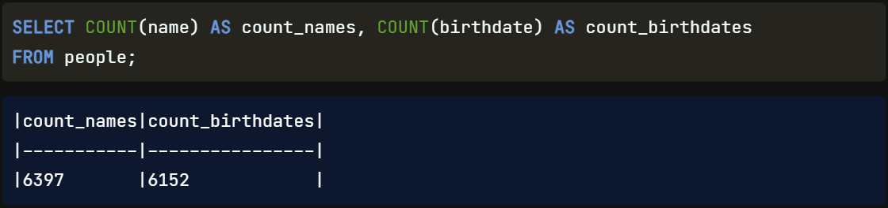
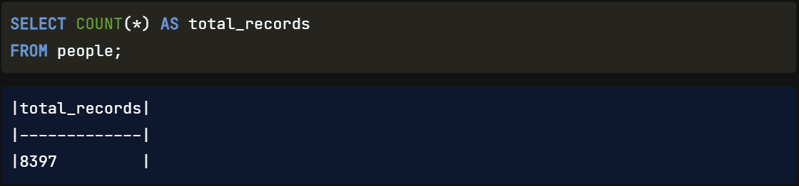
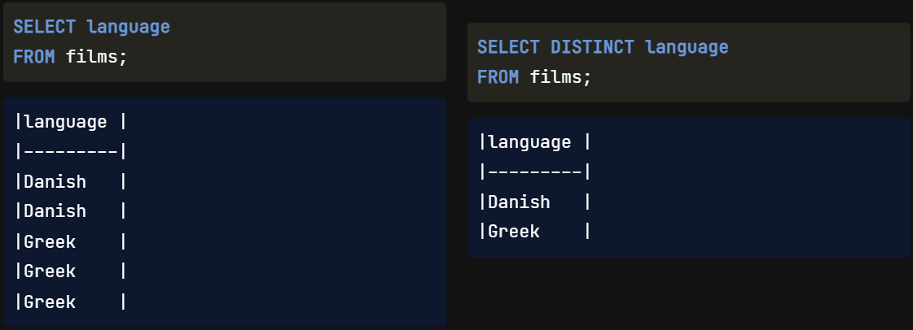
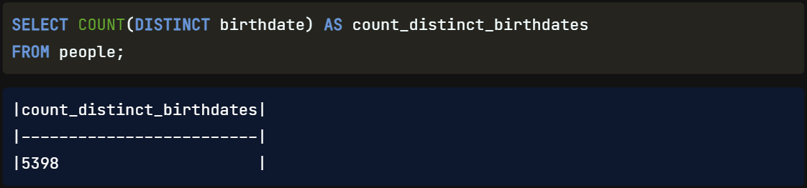

## Querying a Database

Hello, my name is Jasmin Ludolf, and I'll be your instructor for this course on using SQL to `turn raw data into actionable insights`. We'll build on our foundational knowledge of SQL, learn how to `reveal insights`, and how to `present our results clearly`.

## Course Roadmap

While SQL can be used to create and modify databases, the `focus of this course` will be `querying databases`. Recall that a `query is a request for data from a database`. In this course, we'll look at `how to execute a query` for a database `using keywords` that will enable us `to count and view all or a specified amount of records`. We'll go over `common SQL errors`, `style guidelines`, and `the order` in which our `code will execute`. We'll cover how to `filter data` using various techniques, how to use `aggregate functions`, and finally, how to `sort and group the results`. We'll be using PostgreSQL throughout.

## Films Database

We will work with a films database containing `four tables`: `films`, `reviews`, `people`, and `roles`. Our `database schema`, pictured here, `shows` the `table names`, `field names`, and `data types`.

## COUNT()

Here we go with our first new `keyword`. Let's say we wanted to count something from our people table. The `COUNT function` lets us do this by `returning the number of records with a value in a field`. For example, to count the number of birth dates present in the people table, we will use `SELECT COUNT` birthdate `FROM` people. The result is 6152 birthdates. We've used the alias "count birthdates" for the field name in this example to make the results more readable.

## COUNT() for Multiple Fields

If we want to `count more than one field`, we need to use COUNT multiple times. Here we are counting both the number of names and birth dates present in the people table.

## Count(*)

Using COUNT with a field name tells us how many values are in a field. However, if we want to `count the number of records in a table`, we can call `COUNT with an asterisk`. For example, this code gives the total number of records in the people table. The `asterisk represents all fields`. Passing the asterisk to COUNT is a `shortcut` for counting the total number of records.

## DISTINCT

`Often`, our `results` will `include duplicates`. We can use the `DISTINCT keyword` to `select all` the `unique values from` a `field`. This might be useful if, for example, we're interested in knowing which languages are represented in the films table. Adding DISTINCT to our query will remove all duplicates, as we can see here.

## COUNT() with DISTINCT

Combining COUNT with DISTINCT is also common to `count the number of unique values in a field`. This query counts the number of distinct birth dates in the people table. Let's take a moment to consider why this number is different from the birthdate count of 6152 we got before. `Some people in our table likely share the same birthday`; `COUNT` would `include all the duplicates` while `DISTINCT counts all` of the `unique values`, no matter how many times they come up.

