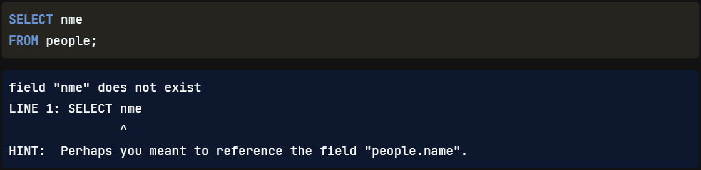
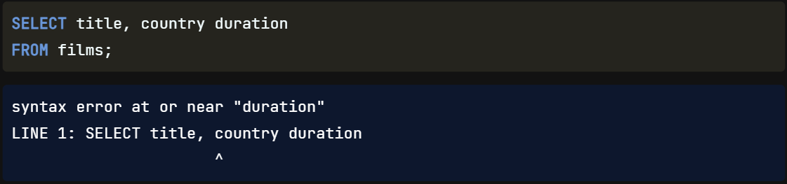

Fantastic work on using COUNT and DISTINCT! Now that we've flexed our SQL muscle a bit, we'll take a small step back and `better understand how SQL code works`.

## Order of Execution

Unlike many programming languages, `SQL code` is `not processed in` the `order it is written`. Consider we want to grab a coat from a closet: `first`, we need to know which closet contains the coats. This is similar to the `FROM` statement, which is the first line to be processed. Before any data can be selected, the table from which the data will be selected needs to be indicated. `Next`, our `SELECT`ion is made. `Finally`, the `results are refined`. Here we use the `LIMIT` keyword that limits the results to a specified number of records. In this case, we only want to return the first ten names from the people table. `Knowing processing order` is especially `useful when debugging and aliasing fields and tables`. Suppose we need to refer to an alias later on in our code. In that case, that alias will only make sense to a processor when its declaration in the SELECT statement is processed before the alias reference is made elsewhere in the query. `Aliases` are `declared in` the `SELECT statement`.

Written Order | Execution Order
---|---
**SELECT** | `FROM`
**FROM** | `SELECT`
**LIMIT** | LIMIT

## Debugging SQL

Before we begin working with more advanced queries, it's `useful to know` more about `debugging SQL code and how to read the error messages`. `Some messages` are extremely `helpful`, `pinpointing` and even `suggesting` a `solution` for the error, as this message does when we `misspell` the "name" field we'd like to select. Other common errors may involve `incorrect capitalization` or `punctuation`.

## Comma Errors

`Other error messages are less helpful` and `require us to review` our code more `closely`. `Forgetting a comma is` a very `common` error. Let's say we've drafted this code to find all titles, country of origin, and duration of films. The `error message will alert us to` the `general location` of the error `using a caret below` the `line of code`, which in this case points to the "country" field name. We `must examine the code a little further`, though, to discover the `missing comma is between "country" and "duration".

## Keyword Errors

SQL displays a `similar error message when` a `keyword` is `misspelled`, but `this time`, the `caret indicator` below the offending line `is spot on`.

## Master Debugging

There are a few more SQL errors out there, but the three mentioned in this lesson will be the most common ones we will encounter. `Debugging` is a `major skill`, and `the best way to master` this skill `is to make mistakes and learn from them`.