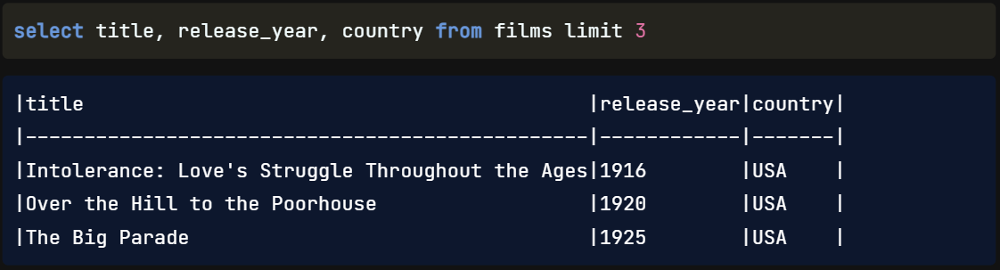

Terrific job! Now that we understand how SQL works, we'll `review how it looks`.

## SQL Formatting

SQL is a `generous` language when it comes to `formatting`. `New lines`, `capitalization`, and `indentation are not required` in SQL as they sometimes are in other programming languages. For `example`, the `code in this image will run just fine`, returning the first three titles, release years, and countries from the films table. `However`, writing queries like this won't make us any friends in the SQL world because the lack of formatting `makes the code difficult to read`, `especially` with `complex queries`.

## Best Practices

Over time, SQL users have developed `style standards` that are generally `accepted across industries`. This `code returns the same results` as the code in the previous image, `but` it is `much easier to read due to` the addition of `capitalized keywords` and `new lines` between them.

## Style Guides

While keyword capitalization and new lines are standard practice, many of the finer details of SQL styles are not. For instance, `some SQL users` prefer to create a new line and `indent each selected field when` a query selects `multiple fields`, as the query in this image does.

Because of the different formatting styles, it's `helpful to follow a SQL style guide`, such as `Holywell's`, which `outlines` a standard of best practices for `indentation`, `capitalization`, and `naming conventions` for tables, fields, and aliases. Remember, though, that there is no single required formatting in SQL: the `guiding principle` is `writing clear` and `readable code`.

https://www.sqlstyle.guide/

## Semicolon

Have you noticed the sample code we've been looking at throughout this lesson has a semicolon at the end? Like capitalization and new lines, this `semicolon` is `unnecessary in PostgreSQL`; we could `leave it out` of the query and still expect the `same results` with `no errors`. `However`, including a `semicolon at the end of the query` is considered `best practice` for several reasons. First, `some SQL flavors require it`, so it's a good habit to have. Including a semicolon in a PostgreSQL query means that the `query is more easily translated to another flavor` if necessary. Additionally, like a period at the end of a sentence, a semicolon `at the end of a query indicates its end`, which is `helpful in a file containing several queries`.

## Non-Standard Field Names

One last note on SQL style: while we can ensure our code is formatted beautifully, we `don't have control over other people's SQL style`. When creating a table, a `SQL mistake` is `including spaces in` a `field name`. `To query` that table, we'll need to `enclose` the `field name` in `double-quotes` to `indicate` that, despite being two words, the `name refers to` just `one field`. For example, if a sloppy SQL coder had named a field 'release year' as two words, we'd need to update the query we've seen throughout this chapter to the one shown here.

## Why Format?

Adhering to `SQL style guides allows` for `easier collaboration` between peers. Having `clean` and `readable code` is `highly valued in` the `community` and a `professional setting` and will make things `easier` for anyone `understanding` or `debugging` our `queries`.