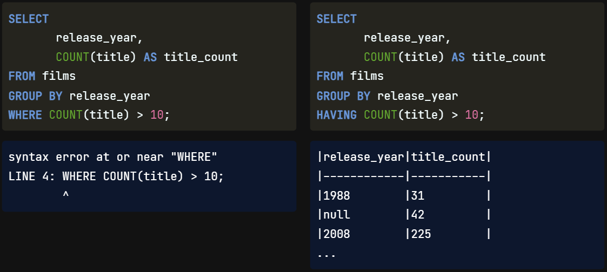
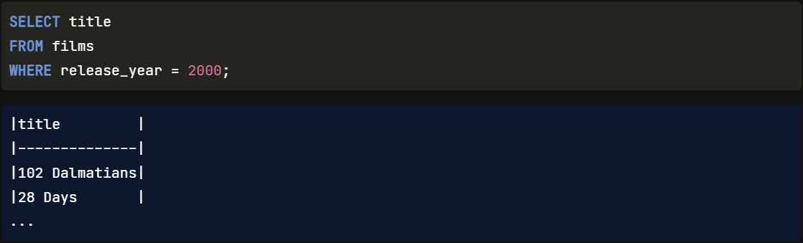
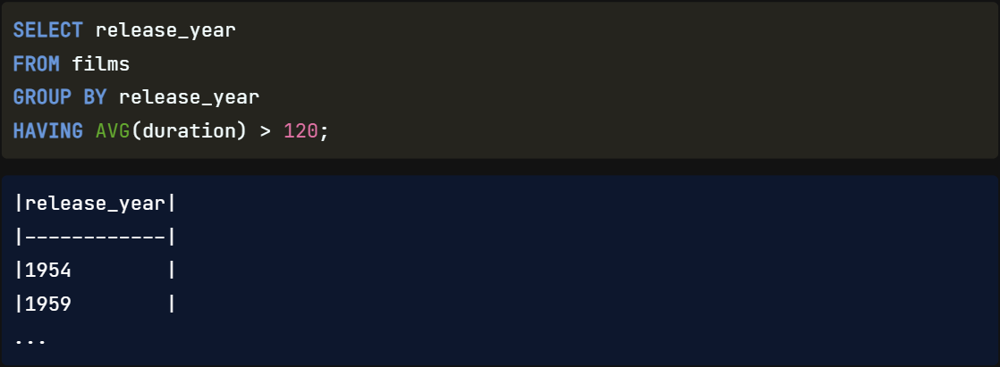

That was excellent work. We've combined sorting and grouping; next, we will combine `filtering` **with** `grouping`.

## HAVING

**In SQL**, we `can't` `filter` `aggregate functions` **with** `WHERE` clauses. For example, this query attempting to filter the title count is invalid. That means that if we want **to** `filter` **based on the** `result` **of an** `aggregate function`, we need another way. `Groups` `have` **their own special** `filtering word`: `HAVING`. For example, this query shows only those years in which more than ten films were released.

## Order of Execution

The `reason` **why** `groups` `have` **their own** `keyword` for filtering comes down to the `order of execution`. We've written a query using many of the keywords we have covered here. This is their written order, starting with SELECT, FROM films, WHERE the certification is G, PG, or PG-13, GROUP BY certification, HAVING the title count be greater than 500, ORDER BY title count, and LIMIT to three. In contrast, the order of execution is: FROM, WHERE, GROUP BY, HAVING, SELECT, ORDER BY, and LIMIT. By reviewing this order, we can see `WHERE` **is** `executed` `before` `GROUP BY` **and** `before` **any** `aggregation` occurs. This order is **also why** we `cannot` `use` the `alias` **with** `HAVING`, `but` we `can` **with** `ORDER BY`.

Written Order   |   Execution Order 
---             |   ---
SELECT          |   `FROM`
FROM            |   `WHERE`
WHERE           |   `GROUP BY`
GROUP BY        |   `HAVING`
HAVING          |   `SELECT`
ORDER BY        |   ORDER BY
LIMIT           |   LIMIT

## HAVING vs WHERE

`WHERE` **filters** `individual` **records** while `HAVING` **filters** `grouped` **records**. We'll walk through two business questions here to show `how to` `translate` **them into the** `correct filter`. The first question is "`What films were released in the year 2000?`". This `question` `does not` `indicate` any sort of `grouping`. It asks to see only the titles from a specific year and can therefore be written as SELECT title, FROM films, WHERE release year equals 2000.

The second question is, "`In what years was the average film duration over two hours?`". Straight away, we can see this `question` `has` a few `more layers`. **Let's** `break down` the `question` and query into smaller, easier-to-understand steps. 

This `question` `requires` **us to** `return information` **about** `years`, **so we** `SELECT` the `release year` `FROM` the `films` table. **Next**, it **asks for the** `average` `film duration`, which **tells us we need to place** `AVG(duration)` **somewhere**. Since **we** `do not` `need` **to** `provide` any `additional information` `around` the `duration` **on its own**, **it is** `unlikely` **we need to** `perform` **the** `aggregation` `within` the `SELECT` clause, **so we'll try** the `HAVING` clause instead. The **last part** of the question **indicates we need to** `filter` on the `duration`. **Since we** `can't` `filter` `aggregates` **with** `WHERE`, **this** `supports` **our** `theory` **about using HAVING**! **Finally**, we **need to add** a `GROUP BY` into our query `since` **we have** `selected` **a** `column` **that has** `not been` `aggregated`. **Recall** the `aggregate function` **will** `convert` **the duration values into** `one` `average value`. Going back to the start of our question, **we're interested in** knowing the `average duration` `per year`, so we `group` it `by` `release year`. And there we have it!

