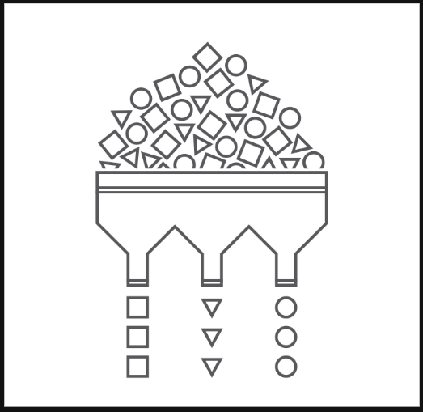
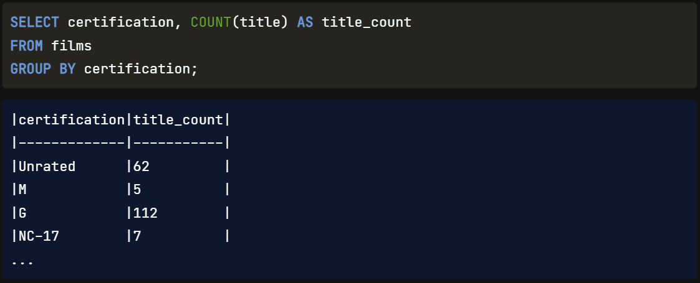
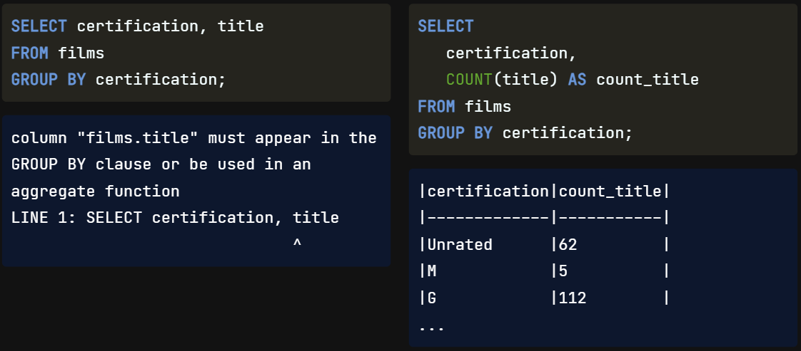
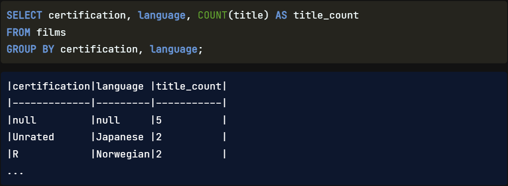
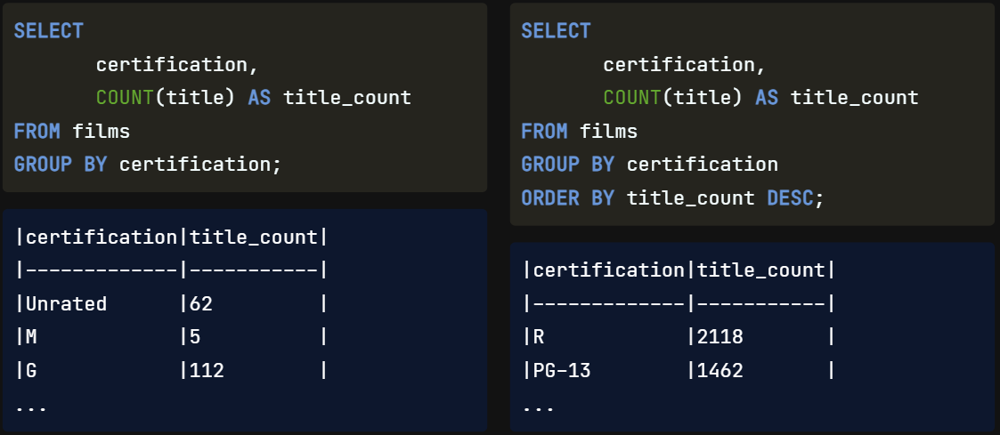

We've learned how to `sort data`. `Next`, we'll look at `grouping` our `results`.

In the real world, we'll `often` need **to** `summarize data` **for a particular** `group` **of** `results`. For `example`, we might want to see the `film data` `grouped by` `certification` **and make** `calculations` **on those** `groups`, **such as the** `average duration` for `each` `certification`.

## GROUP BY Single Fields

SQL allows us to group with the GROUP BY clause. Here it is used in a query where we have grouped by certification. `GROUP BY` is `commonly used` **with** `aggregate functions` to `provide` `summary statistics`, particularly **when** `only GROUPing` **a** `single field`, certification, **and** `SELECTing` `multiple fields`, certification and title. This is **because** the `aggregate function` will `reduce` the `non-grouped field` **to** `one record only`, **which will** `need` **to** `correspond` **to** `one group`.

## Error handling

SQL will return an `error` **if we** try to `SELECT` **a** `field` that is `not in` **our** `GROUP BY` **clause**. We'll need to `correct` **this** `by` `adding` an `aggregate function` around title.

## GROUP BY multiple fields

We can use GROUP BY on multiple fields similar to ORDER BY. **The** `order` in which `we write` the `fields` `affects how` the `data` **is** `grouped`. The query here selects and groups certification and language while aggregating the title. The result shows that we have five films that have missing values for both certification and language, two films that are unrated and in Japanese, two films that are rated R and in Norwegian, and so on.

## GROUP BY with ORDER BY

We can combine GROUP BY with ORDER BY **to** `group` our `results`, `make` **a** `calculation`, **and then** `order` our `results`. For example, we can clean up one of our previous queries by sorting the results by the title count in descending order. Here is that query without ORDER BY, and this is the same query with ordering added. ORDER BY is always written after GROUP BY, and notice that we can refer back to the alias within the query. That is because of the order of execution. It looks like movies rated R are most common in our database.

## Order of execution

GROUP BY fits into our order after FROM and before all other clauses. Our updated queries will begin with FROM, followed by grouping, selecting the data and creating the alias, sorting the results, and limiting them to the desired number.