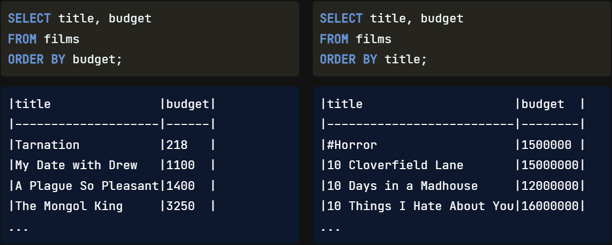
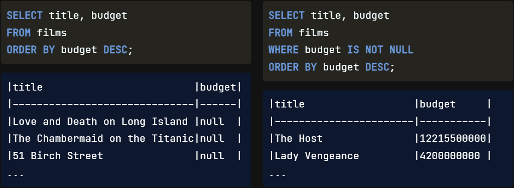
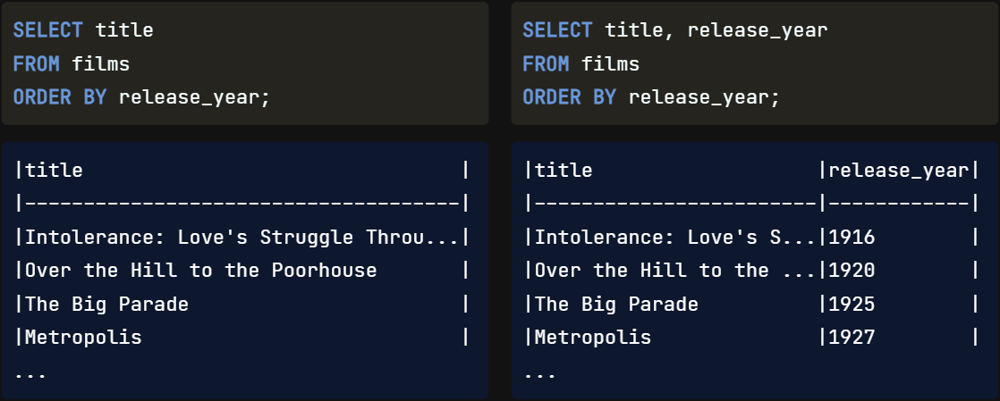
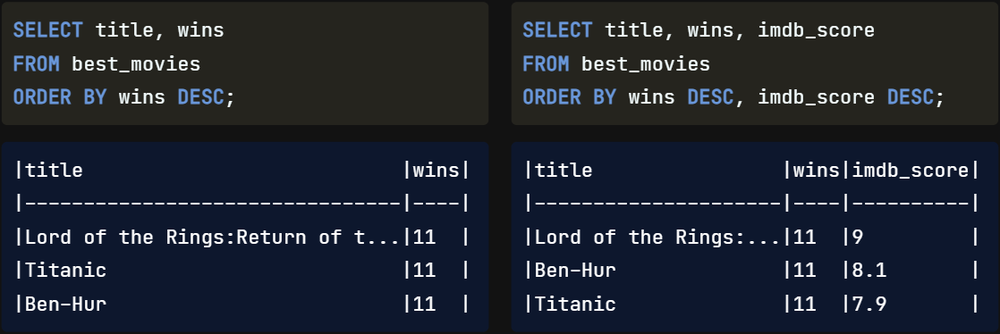
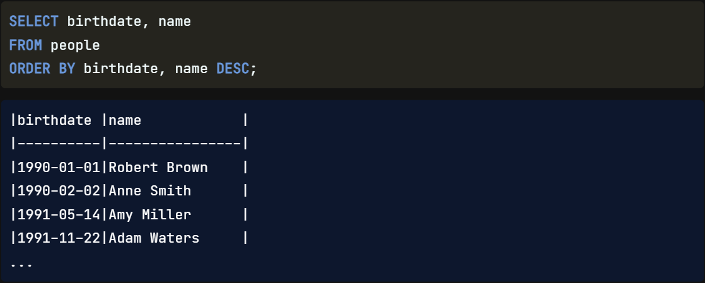

Congratulations on making it this far! We'll now learn how to `sort` **and** `group` `results` **to gain further** `insight`.

Sorting results means we want to `put` our `data` **in a** `specific order`. It's another way to make our data easier to understand by quickly **seeing it in a** `sequence`. Let's say we wanted to extract our three longest coats; if our closet were messy, it would take a long time to find. However, if we sorted our closet by garment type and length, we could quickly grab them!

## ORDER BY

In SQL, the `ORDER BY` **keyword** is used to `sort results` **of** `one or more` `fields`. When used `on its own`, **it is written** `after` the `FROM` statement, as shown here. ORDER BY will `sort` **in** `ascending` order **by** `default`. This can mean from smallest to biggest or from A to Z. In this case, we have one query sorting the budget from smallest to biggest and a second query sorting the titles alphabetically. Our database contains film titles that start with `symbols` **and** `numbers`; these `come before` the letter `A`.

## ASCending

We could also add the `ASC` **keyword** to our query to clarify that we are **sorting in** `ascending order`. The `results` **are the** `same`, **and** our `code` **is more** `readable`.

## DESCending

We can use the `DESC` **keyword** to **sort** the results **in** `descending order`. This query gives us the film titles sorted by budget from biggest to smallest. However, our `data` `contains` **a lot of** `null values`. We can `add` a `WHERE` clause `before` `ORDER BY` **to** `filter` the budget field **for** `only non-null values` **and improve our results**.

## Sorting fields

Notice that we don't have to select the field we are sorting on. For example, here's a query where we sort by release year and only look at the title. However, it is a good idea to `include` **the** `field` **we are** `sorting` **on in the** `SELECT` **statement for** `clarity`.

## ORDER BY multiple fields

`ORDER BY` can also be used to `sort` **on** `multiple fields`. It will sort by the first field specified, then sort by the next, etc. To specify multiple fields, we `separate` the `field names` **with a** `comma`. The `second field` we sort by can be thought of as **a** `tie-breaker` **when** the `first field` **is** `not decisive` **in telling the** `order`. Here is an **example**. Let's say we wanted to find the best movie. In the first query, we are only sorting the films by the number of `Oscar wins` and getting a `tie`. We can `break` that `tie` **by** `adding` a second sorting field by seeing which film has the most wins and the highest `imdb_score`.

## Different orders

We **can** also `select` **a** `different order` **for** `each` `field` **we are sorting**. For **example**, here, we are sorting `birthdate` **in** `ascending` order **and** `name` **in** `descending` order.

## Order of execution

`ORDER BY` `falls towards` **the** `end` **of the** `order of execution` we already know, coming in just `before` `limit`. The `FROM` statement will execute **first**, **then** `WHERE`, **followed by** `SELECT`, `ORDER BY`, **and finally**, `LIMIT`.

Written Order   |   Execution Order
---             |   ---
SELECT          |   `FROM`
FROM            |   `WHERE`
WHERE           |   `SELECT`
ORDER BY        |   ORDER BY
LIMIT           |   LIMIT