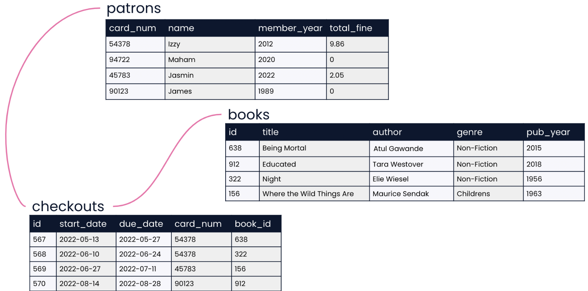
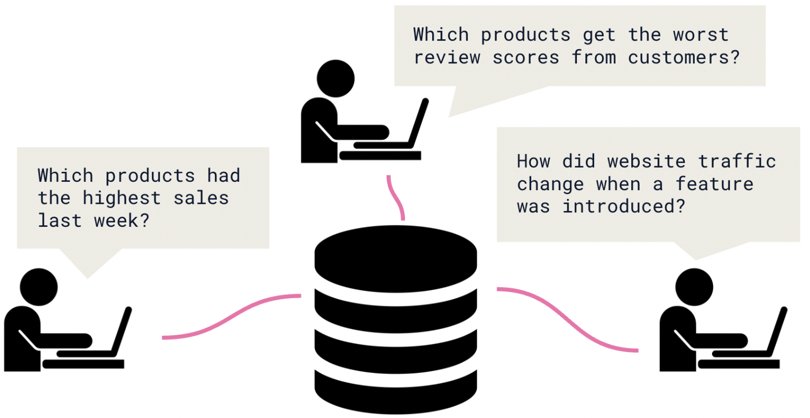
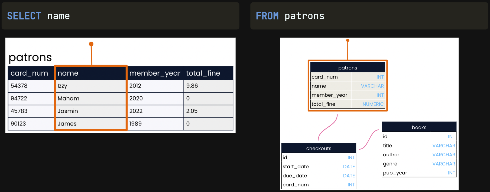
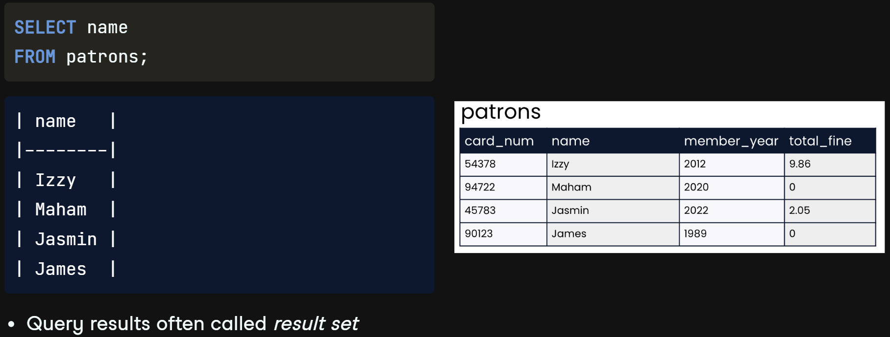
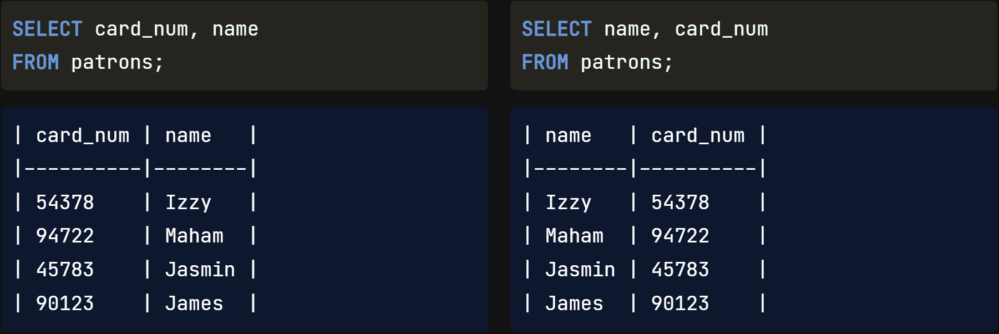
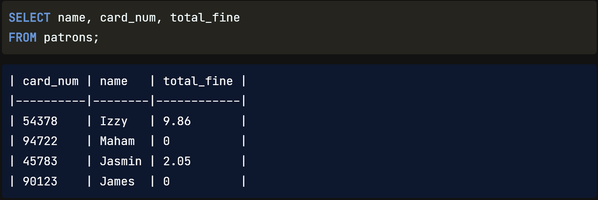
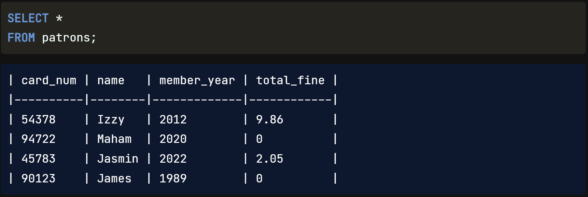

Welcome back. Now that we understand how data is organized in databases, we can begin `drawing insights` using SQL queries!

## SQL Uses

Recall from the last chapter that SQL is used to `answer questions` both `within and across relational database tables`. In the `library database`, we might use SQL to `find which books James checked out` from the library `in 2022`. In the `HR database`, we can `check` the `salaries of Marketing and Accounting employees to see if pay is similar across departments`.

## Best for Large Datasets

In many organizations, `SQL` is used as a `complement` to `other tools` such as `spreadsheet applications`. `If` the `data` we're interested in `can fit in` a `spreadsheet` and `does not have many relationships` to other data of interest, we `can analyze it in` a `spreadsheet`. But for `sprawling and diverse data` such as the data related to a `retail platform`, organizing the data in a `database is best`. Then, we use `SQL queries` to `uncover trends` in website `traffic`, customer `reviews`, and product `sales`. SQL shines when an organization has lots of data with complex relationships.

## Keywords

Let's write our first SQL code! To do that, we will need to learn a few keywords. Keywords are `reserved words` used to indicate what `operation` we'd like our code to perform. The `two most common` keywords are `SELECT` and `FROM`. Perhaps we'd like a `list of every patron our library has`. The `SELECT` keyword `indicates which fields should be selected` - in this case, the `name field`. The `FROM` keyword `indicates the table in which these fields are located` - in this case, the `patrons table`.

## First Query

Let's `put these parts together`. Here's how the query should be written. The `SELECT statement` appears `first`, followed on the `next line` by the `FROM statement`. It's `best practice` to `end` the `query with` a `semicolon to indicate` that the `query is complete`. We `also capitalize keywords while` keeping `table and field names` all `lowercase`. Now let's take a look at the `results of` our `query`, often `called` a `result set`. The result set `lists all patron names`, just as we had hoped. Note that we have `not changed` our `database by` writing `this query`. The tables, including the patrons table, are exactly the same as before we wrote the query. In order to `share` our `results`, we can `save` the `SQL code` we have written so that our `collaborators can use it` to query the database `themselves`. We'll cover saving queries in a later lesson.

## Select Multiple Fields

To select multiple fields, we can `list` multiple `field names after` the `SELECT` keyword, `separated by commas`. For example, to select card number and name, we'd `list` both `field names in` the `order we'd like them to appear` in our result set. Notice that this `does not have to match the order the fields are presented in the table`: listing name before card_num means that name appears first in the results.

As you might expect, we can select three fields such as name, card_num, and total_fine by listing all three field names after the SELECT keyword and separating them with commas.

## Select All Fields

What if we'd like to select all four fields in the patrons table? We `could list out` the four `field names` after the SELECT statement, `but` there's an even `easier way`: we can tell SQL to select all fields `using` an `asterisk` in place of the four field names.

