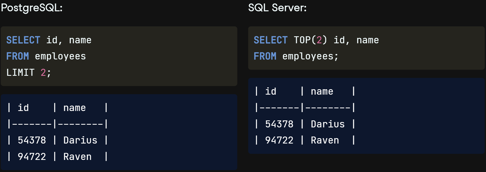

## Introduction

SQL has a few `different versions`, or `flavors`. `Some` are `free`, while `others have customer support` and are made to `complement major databases` such as `Microsoft's SQL Server` or `Oracle Database`, which are `used by many companies`. All SQL flavors are used with table-based relational databases like the ones we've seen, and the vast majority of keywords are shared between them! In fact, `all SQL flavors must follow universal standards` set `by` the `International Organization for Standards` and the `American National Standards Institute`. Only `additional features` on top of these standards `result in different SQL flavors`.

## Two Most Popular SQL Flavors

Let's take a look at two of the most popular SQL flavors. `PostgreSQL` is a `free` and `open-source` relational database system which was originally `created at` the `University of California`, Berkeley, and was `sponsored by` America's famous `Defense Advanced Research Projects Agency`, or `DARPA`. DARPA `also sponsored research leading to` creating the `internet`, the `computer mouse`, and `GPS!` The name "`PostgreSQL`" is used to `refer to both` the `database system` itself `and` the `SQL flavor` used with it. `SQL Server` is also a relational database system which comes in both `free and enterprise versions`. It was created `by Microsoft`, so it `pairs well with other Microsoft products`. `T-SQL is` Microsoft's proprietary `flavor` of SQL, used with SQL Server databases.

### Comparing PostgreSQL and SQL Server

Think of `SQL flavors` as `dialects` of the same language. If Claudia speaks American English, she will have no trouble understanding people on a trip to London, even though most people in London speak British English and there are some small differences.

<!-- start of 'dialects' section -->

    
Definition: Dialects

#
Dialects refer to `variations` of a `language` that `arise` within a specific `geographic area`, `social group`, or `community`.

---

<!-- end of 'dialects' section -->

#
Here's an example of a `small difference between SQL Server and PostgreSQL`: when we want to `limit` the `number of records returned`, we use the `LIMIT` keyword `in PostgreSQL`. Here, we limit the number of employee names and ids selected to only the first two records. The exact `same results` are `achieved in SQL Server` using the `TOP` keyword instead of LIMIT. Notice that this keyword is the only difference between the two queries! `Limiting results` is `useful` when `testing code`, since `many result sets` can have `thousands of results!` It's `best to write and test code using` just a `few results before removing` the `LIMIT for the final query`.

## Choosing a Flavor

New SQL learners may wonder which flavor they should learn. This may be an `easy decision if` a `learner knows` that her `employer uses Microsoft's SQL Server`, for example. Or it might be a hard one for a job seeker or student who doesn't know what database management system a future employer might use. `Don't worry too much about what flavor to learn`. As we've seen, the `differences are small`. A PostgreSQL wizard can become a SQL Server wizard by `learning a handful of different keywords`!