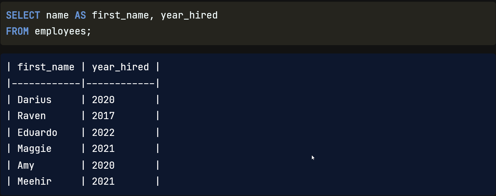
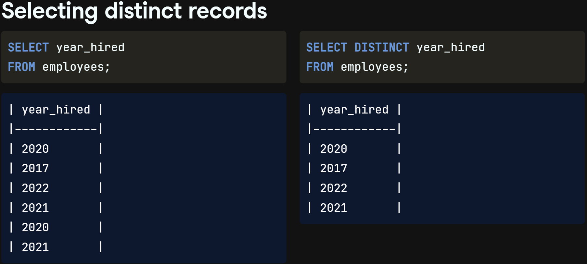
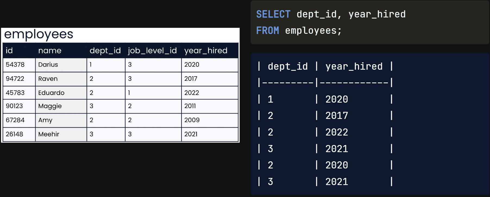
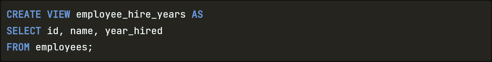
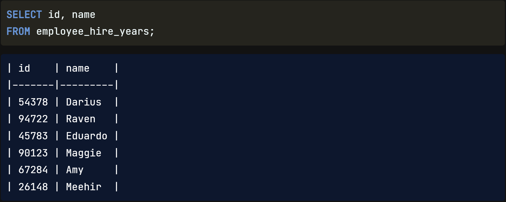

It's time to level up on our SQL queries by learning a few `more commonly used keywords`. Let's dive in.

## Aliasing

`Occasionally`, it proves `beneficial to rename columns in` our `query results`, either `for` the sake of `clarity` or `conciseness`. This can be achieved through aliasing. For instance, if we wish to retrieve the name and hire year for each record in the employees table, we can assign an alias to the name column, such as first_name, using the `AS` keyword in the query. Consequently, the resulting set will display first_name as the column header instead of name. It's important to note that this alias is `specific to` the output of the `current query` and `does not affect` the actual `field name in` the employees `table`, which remains as name rather than first_name.

This is `clear` even `to someone who` is reading only the result set and `does not know the SQL code` behind the results.

## Selecting Distinct Records

Some SQL questions require a way to `return a list of unique values`. Let's imagine that we are interested in getting a list of years in which we hired our current employees. If we select the year_hired field from the employees table, the result set `shows several years listed twice`, which `isn't what we are looking for`. `To get` a list of years with `no repeat values`, we can `add` the `DISTINCT` keyword `before` the year_hired `field name in` the `SELECT statement`. Now, we can see that all of our employees were hired in just four different years.

## Distinct Records with Multiple Fields

It's possible to return the unique combinations of multiple field values by `listing multiple fields after` the `DISTINCT` keyword. Take a look at the employees table. Perhaps we'd like to know the years that different departments hired employees. We could use this SQL query to look at this information, selecting the dept_id and year_hired from the employees table. Looking at the results, we see that department three hired two employees in 2021.

To avoid repeating this information, we could add the DISTINCT keyword before the fields to select. Notice that the department id and year_hired `fields still have repeat values individually, but none of the records are the same`: they are all `unique combinations of` the two `fields`.

## Views

Finally, let's discuss `saving SQL result sets`. In SQL, a view refers to `a table that is the result of a saved SQL SELECT statement`. Views are considered `virtual tables`, which means that the data a view contains is `not` generally `stored in` the `database`. Rather, `it is` the `query code` that is `stored for future use`. A `benefit` of this is that `whenever` the view is `accessed`, it `automatically updates` the `query results` to `account for` any `updates to` the underlying `database`. To create a view, we'll add a line of code before the SELECT statement: `CREATE VIEW`, `then` the `name` we'd like `for` the `new view`, `then` the `AS` keyword `to assign` the `results` of the query `to` the new `view` name. Here, we create a view called employee_hire_years by assigning the results of a query selecting three fields from the employees table to a new view. There is `no result set when creating a view`.

You can `check that the view was created by selecting all columns from the new view`.

## Using Views

`Once a view is created`, however, `we can query it` just as we would a normal table `by selecting FROM the view`.

