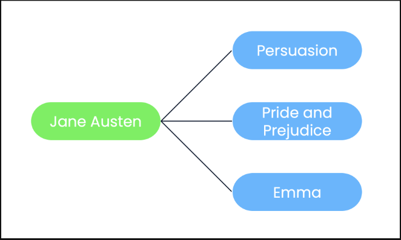

Welcome back! Now that we have written our very first SQL joins, it's time to think more conceptually about the `kinds of` the `relationships` `tables` **can** `have` **to** `each other`.

## One-to-many relationships

The first type of relationship we'll talk about is a one-to-many relationship. This is the most common type of relationship, one where a single entity can be associated with several entities. Think about a music library. One artist can produce many songs over their career. This is a one-to-many relationship. The same applies for authors and their books, directors and movie titles, and so on.

Jane Austen wrote many books, and each of her books had just one author. In the table schema shown, each of her works are stored in the books table, and can be merged with the authors table using author_id from both tables.

## One-to-one relationships

A second type of relationship is a one-to-one relationship. One-to-one relationships imply unique pairings between entities and are therefore less common. A commonly held premise of forensic science is that no two fingerprints are identical, and therefore that a particular fingerprint can only be generated by one person. This is an example of a one-to-one relationship: one fingerprint for one finger.

Imagine fingerprint scanning at airport border control. Border control might have two tables in a database: a table of people and a table of their prints. Each person's fingerprint could be merged with the individuals table using their passport number. We won't cover this in detail here, but using a binary format is one way to store images, such as fingerprints, in a database. Note here that although an individual will have four fingerprints stored in the fingerprints table, this is not a one-to-many relationship. It is a one-to-one relationship, because a single individual - represented as one record on the individuals table - will have one set of fingerprints - represented as one record on the fingerprints table. The four different fingerprints are four different fields in each record.

## Many-to-many relationships

The last type of relationship we'll discuss is a many-to-many relationship. An example of this is languages and countries. Here we show the official languages of Germany, Belgium and the Netherlands, where we see that many languages can be spoken in many countries. For example, Belgium has three official languages: French, German, and Dutch. Conversely, languages can be official in many countries: Dutch is an official language of both the Netherlands and Belgium, but not Germany.

