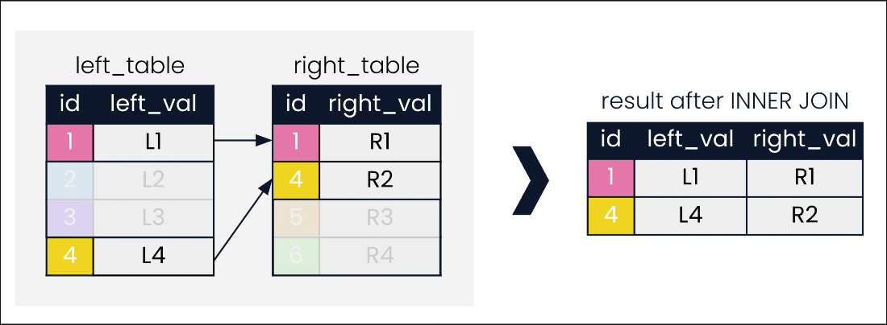

Hello, my name is Maham Faisal Khan, and I'll be your instructor on a journey through the world of SQL joins. Joining data is an essential skill which enables us to draw information from separate tables together into a single, meaningful set of results. Although this course focuses on PostgreSQL, the material here applies to multiple forms of SQL.

We'll begin with INNER JOIN, which along with LEFT JOIN makes up one of the two most common joins. Two tables named "left_table" and "right_table" are shown. Matching values of "id" in both tables are shown in the same color. In both tables, the id field is the key. A key is a single column or group of columns that uniquely identifies records in a table. Both tables also have fields called left_val and right_val, which will help visualize records returned after a join.

With SQL joins, you can join on a key field, or any other field. The INNER JOIN shown looks for records in both tables with the same values in the key field, id. Arrows indicate records where the id matches.

In this diagram, we focus on records that match on id and fade out any records that are not of interest to our INNER JOIN.

The result is records with ids 1 and 4.

## The leadership database schema

Throughout this course, we'll work with a database of world leaders. Our database schema is displayed here. It contains the presidents, prime_ministers and monarchs tables, as well as the states table containing independence years, and the prime_minister_terms table, providing years the prime_ministers assumed office.

## At the presidents table

Let's start querying our database by selecting all fields from the presidents table. Recall the use of the asterisk in SQL to select all fields quickly.

## Meet the prime ministers

Here's a snippet of the prime_ministers table from the same database.

## Prime ministers, meet the presidents

Suppose that we're interested in countries that have both a president and prime minister. In these small tables, we might notice that Egypt, Portugal, Pakistan and India appear in both tables. For larger tables though, it's not as feasible to identify these records by visual inspection. Here's where SQL joins can be helpful.

## Our first INNER JOIN

The syntax for performing an INNER JOIN on our tables is shown step-by-step. It is common to begin constructing the query with the join first, and selecting fields later. After FROM, we list the left table, followed by the INNER JOIN keyword and the right table. We then specify the field to match the tables on, using the ON keyword. Here, we use the "country" field. Lastly, we add SELECT at the start of the query and choose the fields we want returned. When selecting columns that exist in both tables, such as "country" and "continent", the table-dot-column_name format must be used to avoid a SQL error. The result of our query is displayed: four countries in our database have both presidents and prime ministers.

## Aliasing tables

In our INNER JOIN, we've had to type out "president" and "prime_minister" several times. Luckily, we can alias table names using the same AS keyword used to alias column names. Here, we use aliases p1 and p2 in both our SELECT and ON clauses to shorten our query.

## USING

Before we end this lesson, let's add one more SQL shortcut to make our query even more concise. When joining on two identical column names, we can employ the USING command followed by the shared column name in parentheses. Here, since the join field is named "country" in both tables, we can use USING.

