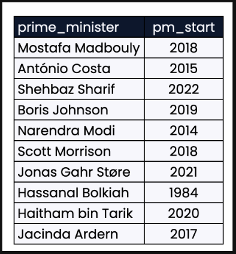
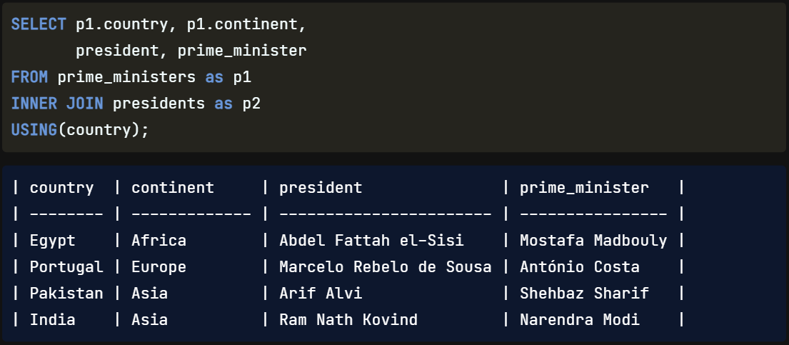
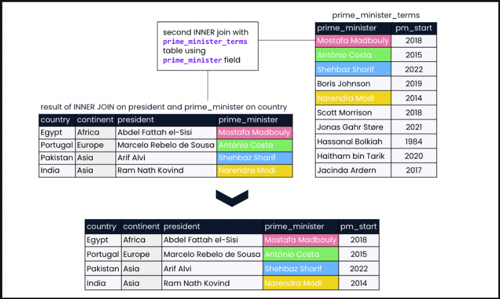
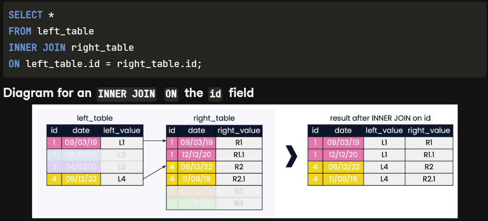
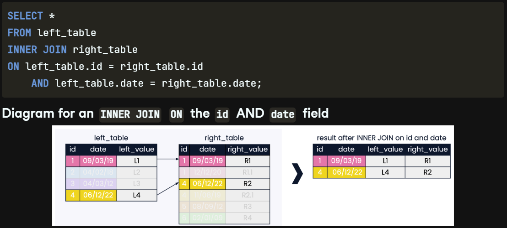

## Joins on joins

A powerful feature of SQL is that multiple joins can be `combined` **and** `run` **in a** `single` `query`. Let's have a look at some syntax for multiple joins. We begin with the same INNER JOIN as before, and then `chain` **another** `INNER JOIN` **to the** `result` **of our** `first` `INNER JOIN`. Notice that we use left_table.id in the last line of this example. If we want to perform the second join using the id field of right_table rather than left_table, we can replace **left_table.id** with **right_table.id** in the final line.

Thinking back to our example of world leaders, let's say that we are interested in **identifying countries**  of the world **that have both a president and a prime minister**, and want to know the **year each prime minister came into office**. Let's have a look at the **prime_minister_terms table** from our database of world leaders. It contains a prime_minister column with prime minister names as well as a **pm_start** column containing the **start year of a prime minister's term**.

## What to join first?

Let's apply the new syntax we have learned to our world leaders example. We can begin as before with an INNER JOIN of the presidents and prime_ministers tables, using our aliasing skills to shorten the length of the query. Recall from our first lesson that the result set of this join was a combined table showing countries with both a prime_minister and a president.

## Chaining joins

If we now join the result of our first INNER JOIN with our prime_minister_terms table on the prime_minister field, the final result will be only those countries with both prime_ministers and presidents, along with the years their prime_ministers assumed office. Notice that the prime_minister_terms table has 10 records, whereas our final result only has four records. This is because only four records from the prime_minister_terms table match the result of our first INNER JOIN.

Here is a look at the final SQL query for chaining a second INNER JOIN to our first INNER JOIN. Notice that the syntax for the second join is exactly the same as for the first join, but we use prime_minister as the field to join on instead. We can continue the chain and join as many tables together as we need!

## What are we joining ON?

Great work! Now let's step back from our world leaders example. One more thing to know about joins is that it isn't always the case that each value in the field being joined on corresponds to exactly one record in the joining field of the right table. In the example shown, if we join on one field as we have done before, the query will return multiple records from right_table that match with left_table on the id field.

## Joining on multiple keys

We can limit the records returned by supplying an additional field to join on by adding the AND keyword to our ON clause. In this example, we join on date, a frequently used second column when joining on multiple fields. The result set now contains records that match on both id AND date.

