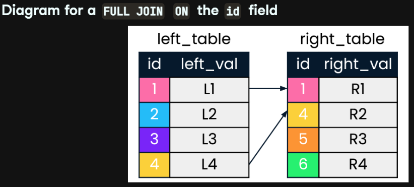
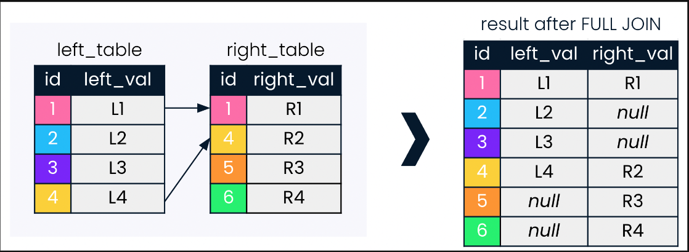
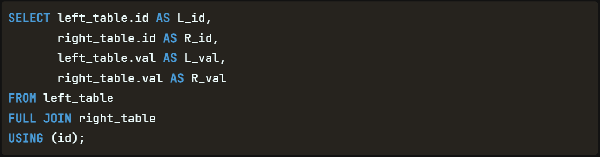
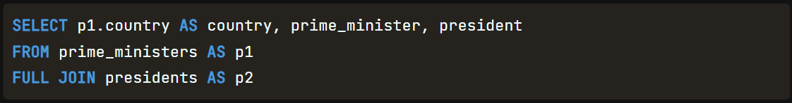
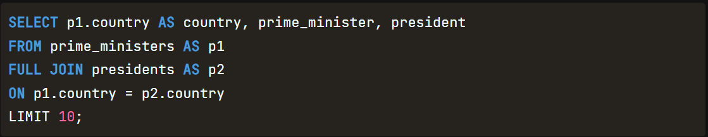
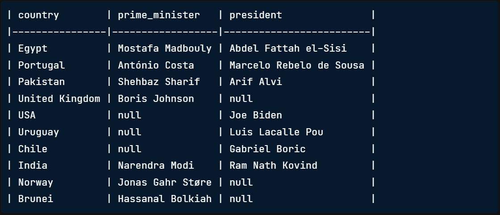

1. FULL JOINs
00:00 - 00:16
In this video, we'll introduce FULL JOIN. FULL JOIN is the last of the three types of outer join. We'll compare FULL JOIN to the two other types of outer join we have learned (LEFT JOIN and RIGHT JOIN), as well as to INNER JOIN.

2. FULL JOIN initial diagram
00:16 - 00:35
A FULL JOIN combines a LEFT JOIN and a RIGHT JOIN. As you can see in this diagram, no values are faded out as they were in earlier diagrams. This is because the FULL JOIN will return all ids, irrespective of whether they have a match in the other table being joined.

3. FULL JOIN diagram
00:35 - 01:01
Let's have a look at the result after FULL JOIN. We see that it has retained all ids, returning missing values in the form of nulls for fields corresponding to records where id did not find a match. All six ids we have been working with are included in the result after the FULL JOIN. Note that this time, nulls can appear in either left_value or right_value fields.

4. FULL JOIN syntax
01:01 - 01:26
Time for some SQL code. In order to produce a FULL JOIN, the general format aligns closely with the SQL syntax we've been using for INNER JOIN, LEFT JOIN and RIGHT JOIN. We adapt our join to have the word 'FULL' before 'JOIN'. Note that the keyword FULL OUTER JOIN can also be used to return the same result.

5. FULL JOIN example using leaders database
01:26 - 01:52
Let's make our sample syntax concrete with our example from the leaders database. Suppose we were interested in all the countries in our database, and wanted to check whether they had a president, a prime minister, or both. We'll walk through the code line by line to do this using a FULL JOIN. The SELECT statement starts us off by including the country, as well as the prime_minister and president fields.

6. FULL JOIN example using leaders database
01:52 - 02:12
Next, we specify prime_ministers as our left table and alias this as p1. Note that order of the tables matters here, and if we switched the order, the records would be ordered differently depending on how prime ministers and presidents are ordered in the tables.

7. FULL JOIN example using leaders database
02:12 - 02:19
We then add the FULL JOIN query and add presidents as the right table, using alias p2.

8. FULL JOIN example using leaders database
02:19 - 02:30
Lastly, the join is performed using country as the field to join on in both tables. We LIMIT to the first 10 records.

9. FULL JOIN example using leaders database
02:30 - 02:45
Here is a look at our result. Note that there are null values in both the prime_minister and president fields. We chose a FULL JOIN because we were interested in all countries, whether they had a prime minister, a president, or both.

10. Let's practice!
02:45 - 02:49
Time for some practice!