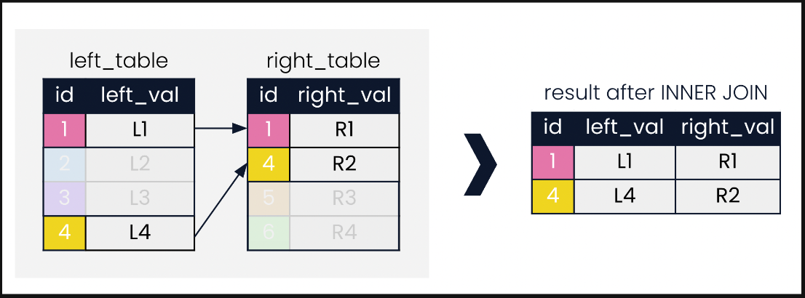
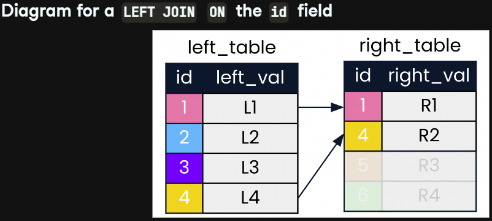
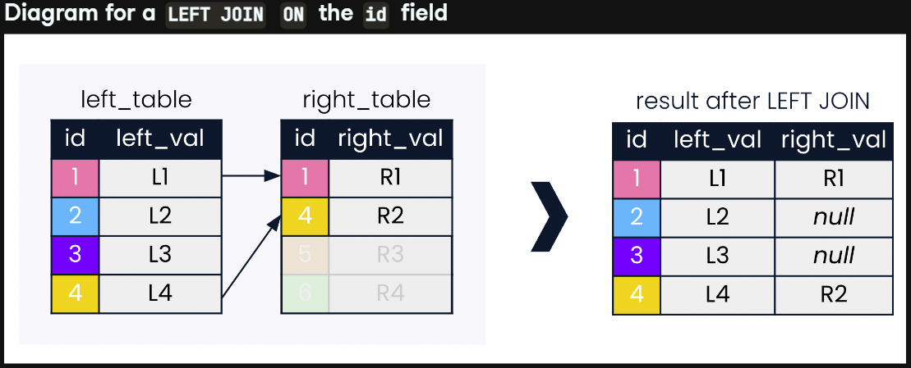
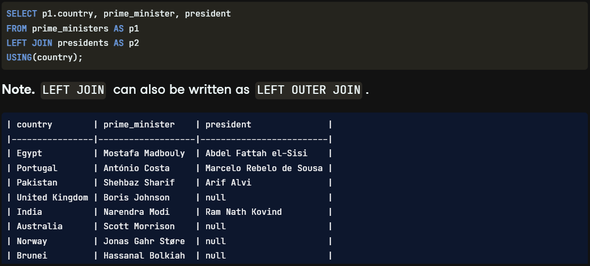
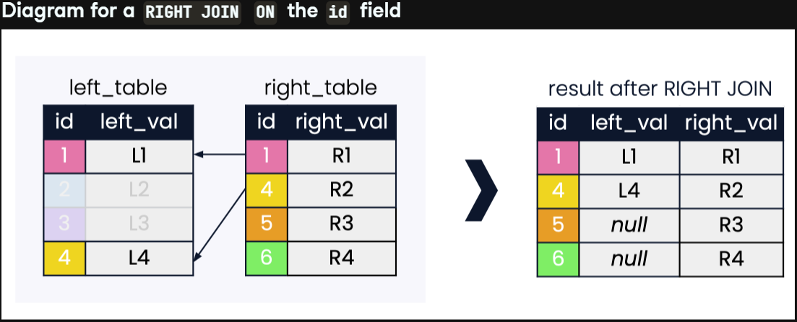
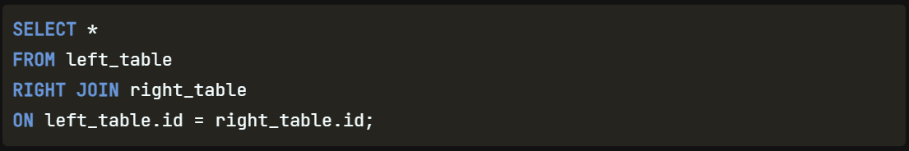
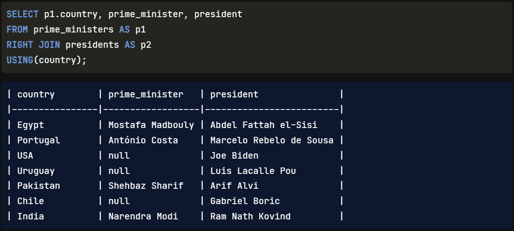

1. LEFT and RIGHT JOINs
00:00 - 00:10
Congratulations on completing Chapter 1 on inner joins, and welcome to Chapter 2 on outer joins, cross joins and self joins!

2. INNER JOIN diagram
00:10 - 00:22
Recall the INNER JOIN diagram from Chapter 1. The only records in the result were those where the id field had matching values in both tables.

3. LEFT JOIN initial diagram
00:22 - 01:00
We'll now compare INNER JOIN with three types of outer joins, beginning with LEFT JOIN. Outer joins can obtain records from other tables, even if matches are not found for the field being joined on. A LEFT JOIN will return all records in the left_table, and those records in the right_table that match on the joining field provided. In the diagram shown, the values of 2 and 3 do not appear in the id field of right_table but will still be retained in the join. Records that are not of interest to a LEFT JOIN on the id field have been faded out.

4. LEFT JOIN diagram
01:00 - 01:25
We now look at the result of the LEFT JOIN on id. INNER JOIN returns only records corresponding to ids 1 and 4, whereas LEFT JOIN keeps all records in left_table, as well as null values for right_val where is no match in right_table. Note that ids 5 and 6 in right_table do not feature in LEFT JOIN in any way.

5. LEFT JOIN syntax
01:25 - 02:14
Let's go back to our world leaders example. Say we want our query to include all countries with prime ministers, presidents if they happen to have them, and missing values if they don't. LEFT JOIN will give us the results we need! The syntax of LEFT JOIN is very similar to INNER JOIN. Only the word INNER is replaced with LEFT. Note that LEFT JOIN can also be written as LEFT OUTER JOIN in SQL. The first three records in the result are the same as they were with an INNER JOIN, but from the fourth record the result starts to look different. Since the United Kingdom does not have a president, a corresponding null value is returned in the president field.

6. RIGHT JOIN
02:14 - 02:47
On to RIGHT JOIN! RIGHT JOIN is the second type of outer join, and is much less common than LEFT JOIN so we won't spend as much time on it here. Instead of matching entries in the id column of the left table to the id column of the right table, a RIGHT JOIN does the reverse. All records are retained from right_table, even when id doesn't find a corresponding match in left_table. Null values are returned for the left_value field in records that do not find a match.

7. RIGHT JOIN syntax
02:47 - 03:05
Generic syntax for a RIGHT JOIN is shown. Note that the order of left_table and right_table is the same as in LEFT JOIN. The only change is that we call RIGHT JOIN instead of LEFT JOIN. RIGHT JOIN can also be written as RIGHT OUTER JOIN in SQL.

8. RIGHT JOIN with presidents and prime ministers
03:05 - 03:27
Let's make this concrete with our world leaders example. We perform a right join of prime_ministers on the left and presidents on the right. The only change is from the LEFT JOIN keyword to RIGHT JOIN. The result contains null values where countries have presidents but no prime ministers.

9. LEFT JOIN or RIGHT JOIN?
03:27 - 03:49
Now that you're familiar with both LEFT and RIGHT JOIN, let's discuss why RIGHT JOIN is less commonly used. A key reason for this is that a RIGHT JOIN can always be re-written as a LEFT JOIN. Because we typically type from left to right, LEFT JOIN feels more intuitive to most users when constructing queries.

10. Let's practice!
03:49 - 03:57
Nice work on navigating some of the most popular types of joins! Let's practice.