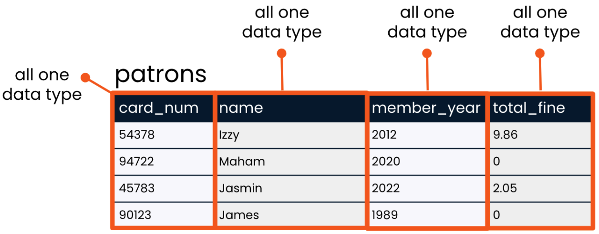
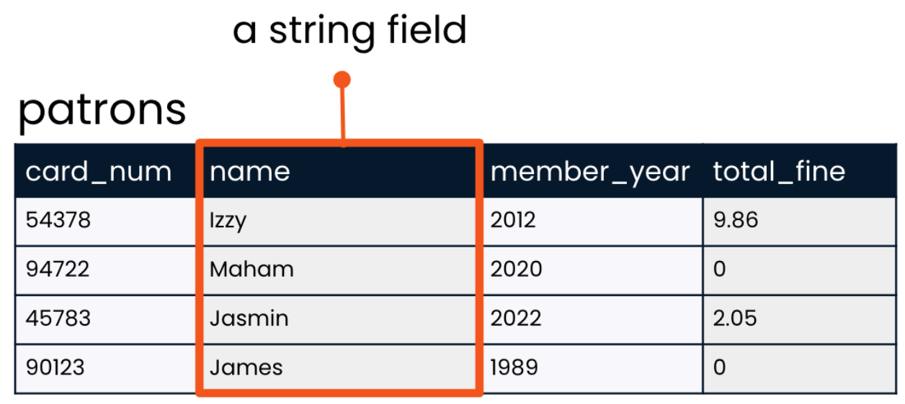
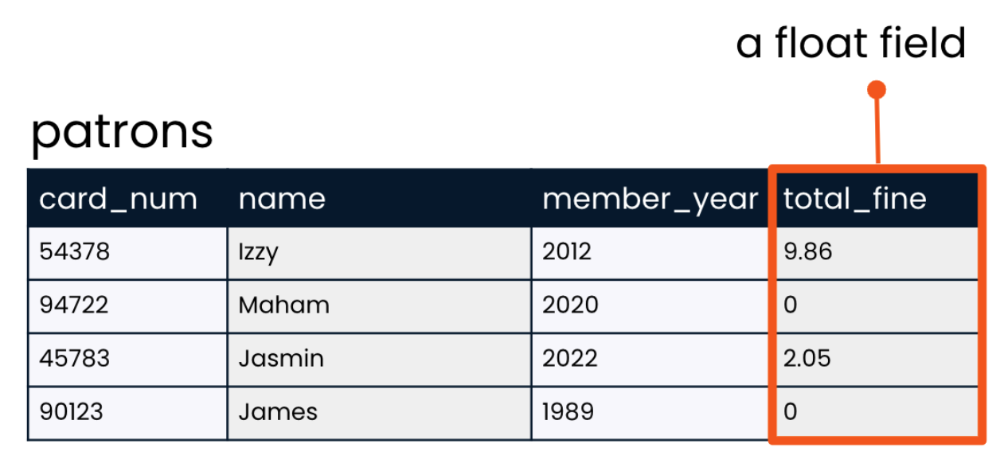
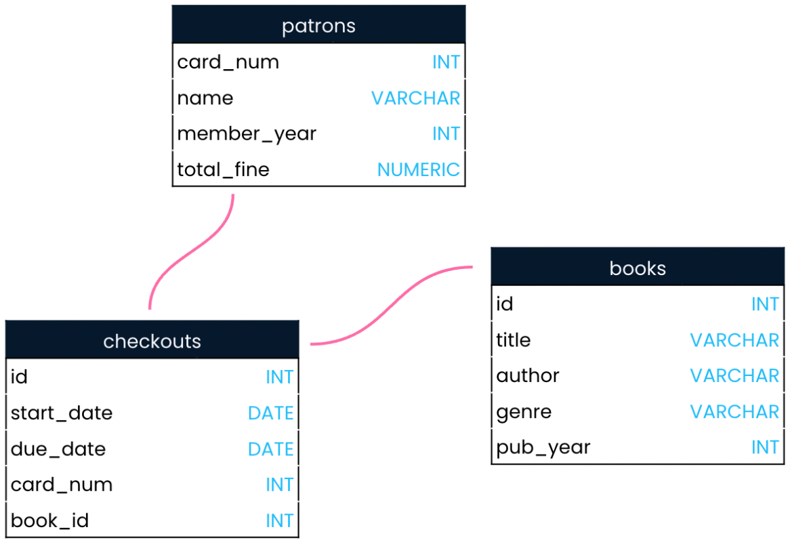

Welcome to the final part of the databases chapter! This lesson will focus on the data inside a database as well as its storage.

## Data Types

When a table is created, a `data type` must be `indicated` for `each field`. The data type is chosen `based on` the `type of data` that `the field will hold` - a `number`, `text`, `or a date` for example. `We use` data types `for several reasons`. First, `different types` of data are `stored differently and` take up `different amounts of storage space`. Second, `some operations only apply to certain data types`. It makes sense to multiply a number by another number, but it `does not make sense to multiply text by other text` for example.

### Strings

In programming, a "`string`" refers to a `sequence of characters` such as `letters or punctuation`. On the patrons table, the data in the `names field` is made up of strings, such as "`Maham`" and "`James`". `SQL` has `several different data types` that can `hold strings`. `Some` string data types can only hold `short strings`, such as a string up to `250 characters`. Storing `short strings` in a small data type like this `saves storage space`. SQL's `VARCHAR data type` is more `flexible` and can `store small or large strings` - up to `tens of thousands of characters!` Because of its flexibility, VARCHAR is very `commonly used` for storing strings.

### Integers

`Integer` data types `store whole numbers`, such as the years in the `member_year` column of the patrons table. Just as with strings, SQL offers a few `different data types for` storing `integers`, depending on how big the numbers we'd like to store are. `INT`, a `common` SQL integer data type, `can store numbers` from `less than negative two billion` to `more than positive two billion!`

### Floats

`Float` data types `store numbers that include a fractional part`, such as the `2.05` dollars that one patron, Jasmin, owes in `fines`. Just as we might expect, SQL also offers `several float data types` depending on how many digits the numbers in the field are expected to be. The `NUMERIC` data type `can store floats` which have `up to 38 digits total` - `including` those `before and after the decimal point`.

## Schemas

Now that we're familiar with data types, we can look at a database schema. Schemas are often referred to as `"blueprints" of databases`. A schema `shows` a database's `design`, `such as` what `tables` are included in the database and any `relationships` between its tables. A schema also lets the reader know what `data type each field can hold`. The schema for our library database shows the `VARCHAR` data type is used `for` strings like `book title`, `author`, and `genre`. We can also see that the `patrons table` is `related to` the `checkouts table`, but not the books table.

## Storage

Finally, let's discuss storage. The `information` we find `in` a `database table` is `physically stored on` the `hard disk of` a `server`. `Servers` are `centralized computers` that `perform services` via `requests` made `over` a `network`. In our case, the `service` performed `is data access`, but `servers` are `also used to` `access websites` or `files stored` on the server. `Any computer can be a server` if it is set up to provide a service, `even a laptop!` However, `servers` are `generally` very `powerful and large machines`, because they are best `equipped to handle` a `high volume of requests and data`.

This attribute of servers is key for databases: `remember`, SQL's `main advantage` is that `several individuals can simultaneously perform queries on a database`.