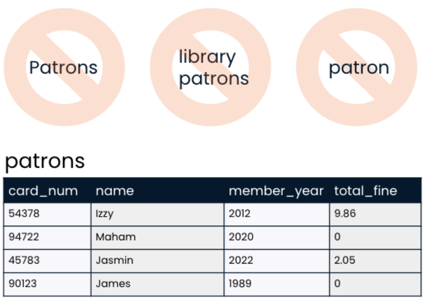
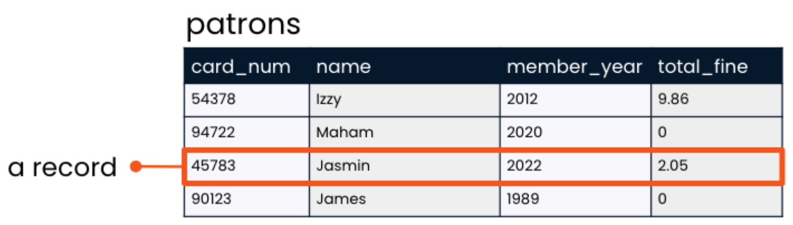
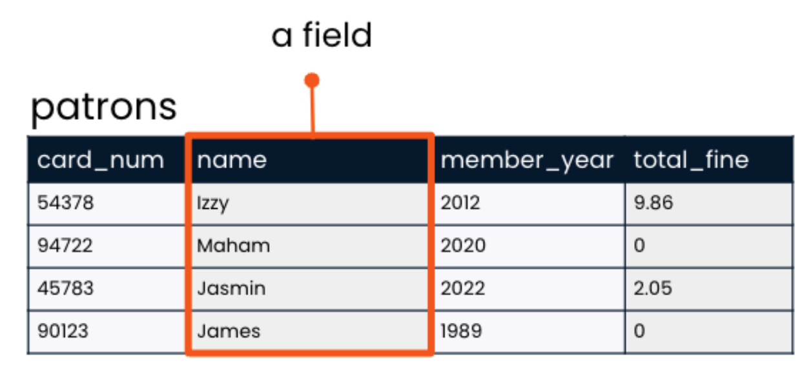
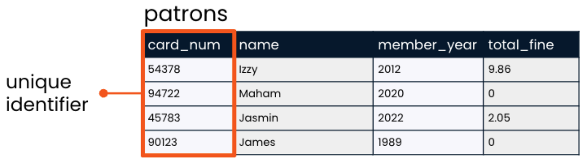
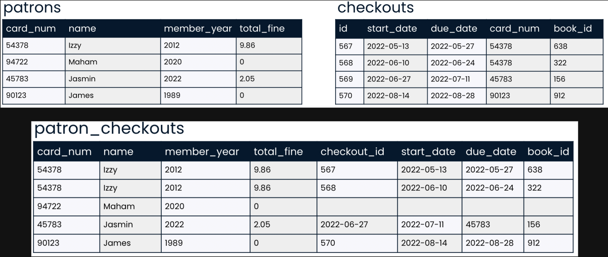

## Introduction

Now that we know the basic organization of a database, let's take a closer look at the `main building block` of databases: tables!

We saw in the previous lesson that databases are organized into tables, which hold related data about a particular subject. As we've seen, tables are organized into rows and columns; in the world of databases, `rows are` often referred to as `records` and `columns as fields`. A table's `fields are limited` to those `set when the database was created`, but the number of `rows` is `unlimited`.

## Table Names

Let's talk a little bit about table naming. `Table names` should be `lowercase` and should `not include spaces` - we `use underscores` in place of spaces. And ideally, a table name would `refer to a collective group` (like "`inventory`") but it's also `okay for` the table to have a `plural name` (such as "`products`").

## Records

`A record is` a row in a table. It holds data on `an individual observation`. Taking a look at the patrons table, we see that the table has four records: one for each of the patrons. The record for Jasmin indicates that she became a member in 2022 and owes two dollars and five cents in fines.

## Fields

`A field` is a column in a table. It `holds one piece of information about all observations` in the table. The "name" field in the patrons table lists all of the names of our library patrons.

### Field Names

Because `field names` must be `typed out when querying` a database with SQL, `field naming is important`. Generally, field names should be `lowercase` and should `not involve spaces`. A field name should be `singular` rather than plural `because it refers to` the information contained in that field for `a single record`. This is why our table has "`card_num`" and "`name`" fields rather than "card_nums" and "names". Similarly, `two fields in a table cannot have the same name`. Finally, field names should `never be the same as the table name` they are housed in so that it's `clear for reference purposes`.

## Unique Identifier (key)

A `unique identifier`, sometimes called a "`key`," `is` just what it sounds like: `a unique value which identifies a record` so that it `can be distinguished from other records in the same table`. This value is very `often a number`. In the `patrons table`, it makes sense to `use the card_num field` as the unique identifier for each patron, `not the name field`, `because` it's possible that as our little library grows, `two patrons might have the same name`.

## Prioritise More Tables

Having `more tables`, each `with a clearly marked subject`, is generally `better than` having `fewer tables where` information about `multiple subjects` is `combined`. Take a look at the patrons and checkouts tables. Now, here's what our patrons and checkouts tables would look like if we tried to combine them. It's the same data, but much less clear because it now `contains duplicate information`. While we can see that Izzy has two checkouts and Maham has none, the `card_num column is no longer unique because of Izzy's multiple checkouts`. We `can` always `use SQL to gather information from multiple related tables` and `connect them if a question requires it`, but `table topics should remain separate`.

