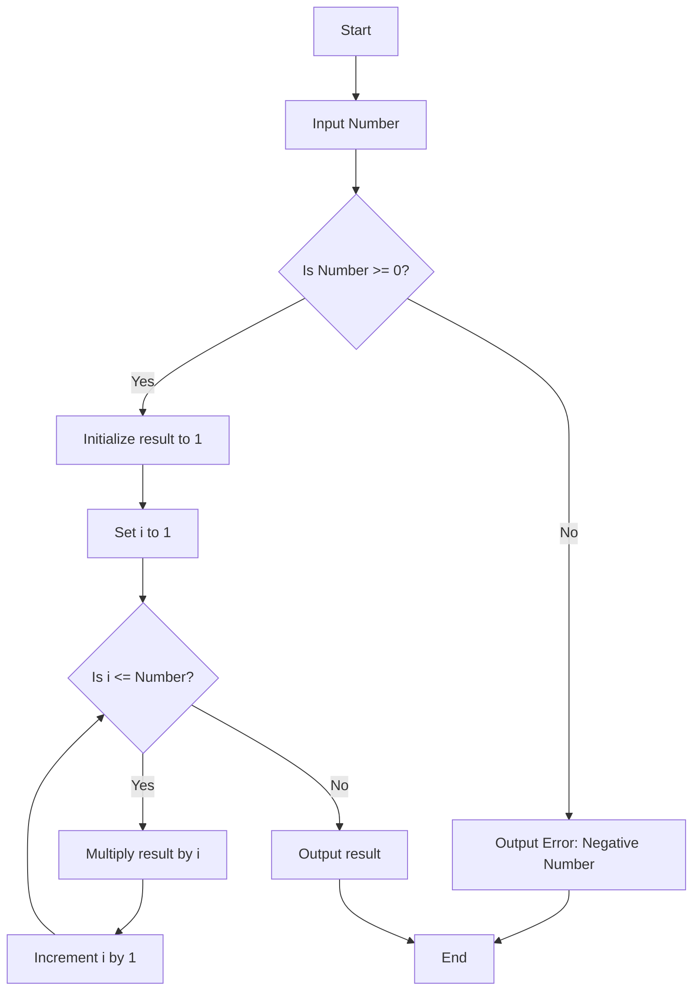

Creating flowcharts can be extremely helpful in visualizing and solving complex problems, especially in software development. Here are a few flowcharts that demonstrate the process of problem-solving and algorithm visualization in JavaScript.

### 1. Flowchart for Problem Solving

#### Breaking Down Complex Problems

Consider a scenario where you need to `break down` **a** `complex problem into` `smaller`, `manageable` `tasks`.

**Example Problem:** **Calculating the factorial of a number**.

<!-- start of 'factorial' section -->

    
Definition: factorial

#

A factorial, **written as** **`n!`**, **is the** `result of` `multiplying all` `whole numbers` `from 1 up to` **`n`**. For example:

- 5! = 5 x 4 x 3 x 2 x 1 = 120
- 3! = 3 x 2 x 1 = 6
- 0! = 1 by definition

**Factorials are** `used in` `math` `for counting` `arrangements and combinations`. 

---

<!-- end of 'factorial' section -->

**Flowchart:**

- **Start**: The `process` `begins`.
- **Input Number**: The `user` `inputs` the `number` **for which the factorial is to be calculated**.
- **Check if Number >= 0**: `If` the `number is` `negative`, an `error is` `output`. `If` `non-negative`, **the** `calculation proceeds`.
- **Initialize Result**: The `result is` `initialized to` `1`.
- **Loop from 1 to Number**: A `loop` `runs from` `1 to` **the** `input number`, `multiplying` **the** `result by` `each number in` **the** `loop`.
- **Output Result**: The `final result is` `output after` **the** `loop ends`.
- **End**: The `process` `ends`.