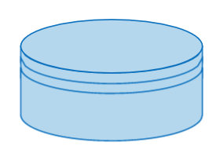

`For more complex` `systems`, `extended symbols` **can** `provide` `additional detail`.

## Symbols

### 1. Database:
- **Symbol**: `Cylinder`



- **Description**: Represents a `database or storage`.

### 2. **Manual Input**:
- **Symbol**: `Rectangle` **with a** `slanted top`


- **Description**: Indicates `data entry` **by a person**.

### 3. Preparation:
- **Symbol**: `Hexagon`


- **Description**: Shows a `setup` `to prepare for` `another step in` **the** `process`.

### 4. Delay:
- **Symbol**: `Half Oval` (`D shape`)


- **Description**: Indicates a `delay in` **the** `process`.

### 5. Loop Limit:
- **Symbol**: Represented as a `rectangle` **with** `squared-off` `top edges`.


- **Description**: Shows the `start of` **a** `loop`.

### 6. Stored Data:
- **Symbol**: Cylinder lying on its side


- **Description**: Represents `data` **that is** `stored on` **a** `hard drive`.

### 7. Merge:
- **Symbol**: `Triangle` `pointing down`


- **Description**: `Combines` `multiple` `processes into` `one`.

### 8. OR:
- **Symbol**: `Circle with` **a** `plus` **sign** `inside`


- **Description**: Indicates that the process `flow` `continues in` `more than two` `branches`.

### 9. Summoning Junction:
- **Symbol**: A `circle with` **a** `cross` `inside`


- **Description**: Indicates a `point` in the flowchart `where multiple branches` `converge back into` **a** `single process`.

### 10. Display:
- **Symbol**: `Half oval` **with an** `isosceles triangle on` `one side`. 


<!-- start of 'isosceles triangle' section -->
<details>
    <summary>Definition: isosceles triangle</summary>

#
An isosceles triangle **is a** `type of` `triangle` **that has** `at least` `two sides of` `equal length`. **The** `angles` `opposite` **these** `equal sides` **are also** `equal`.

---
</details>
<!-- end of 'isosceles triangle' section -->


- **Description**: Represents `information` `displayed to` **the** `user`.

### 11. Collate:
- **Symbol**: `Two` `inverted triangles`, `one` `on top of` **the** `other`


- **Description**: Indicates a step that `orders information into` **a** `standard format`.


<!-- start of 'data standardization' section -->
<details>
    <summary>Definition: data standardization</summary>

#
Data standardization is the **process of** `converting` `data into` **a** `common format` `to ensure` `consistency and comparability` `across different` `datasets`.

---
</details>
<!-- end of 'data standardization' section -->


### 12. Sort:
- **Symbol**: Represented by `two` `isosceles triangles` `joined together on` **the** `longest side`.


- **Description**: Represents a `sorting` `operation`.

### 14. Off-page Connector:
- **Symbol**: `Five-pointed` `polygon`


- **Description**: Typically `accompanied by` **a** `reference point`, **such as a page number**, **section identifier**, **or a unique code** `to guide` **the** `reader to` **the exact** `location where` **the** `process continues`.

### Example Flowchart with Extended Symbols

To illustrate the use of these extended symbols, here is an example of a more complex process:

1. **Start** (`Oval`)
2. **User Input** (`Parallelogram`)
3. **Process Data** (`Rectangle`)
4. **Decision**: Data Valid? (`Diamond`)
   - **Yes**: Proceed to Process Data
   - **No**: Display Error (`Rounded Rectangle`)
5. **Store Data** (`Cylinder`)
6. **Merge Data** (`Triangle`)
7. **Extract Report**
8. **Display Report** (`Half oval` **with an** `isosceles triangle on` `one side`)
9. **End** (`Oval`)

```markdown
            +---------+
            |  Start  |
            +---------+
                 |
                 v
           +------------+
           | User Input |
           +------------+
                 |
                 v
           +--------------+
           | Process Data |
           +--------------+
                 |
                 v
         +-----------------+
         | Decision:       |
         | Data Valid?     |
         +--------+--------+
                  |
        +---------+---------+
        |                   |
       Yes                  No
        |                   |
        v                   v
 +--------------+    +--------------+
 | Process Data |    | Display Error|
 +--------------+    +--------------+
        |                   |
        v                   |
  +-----------+             |
  | Store Data|             |
  +-----------+             |
        |                   |
        v                   |
  +------------+            |
  | Merge Data |            |
  +------------+            |
        |                   |
        v                   |
+------------------+        |
| Extract Report   |        |
+------------------+        |
        |                   |
        v                   |
  +------------------+      |
  | Display Report   |      |
  +------------------+      |
        |                   |
        v                   |
     +--------+             |
     |  End   | <------------+
     +--------+
```

Using **these** `symbols` `ensures` **that even** `complex systems` **can be** `visualized` `clearly and comprehensively`.