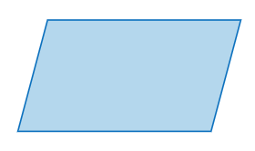

**Creating flowcharts for JavaScript code can be highly beneficial for visualizing the flow of control and data within a script**. Here’s an overview of the standard symbols and notations used in flowcharts, which can be applied to represent JavaScript code logic.

## 1. **Terminator (Start/End)**
- **Symbol:** `Oval`


- **Description:** Represents the `start or end of` **a** `flowchart`.
- **Example:**
  - Start
  - End

## 2. **Process**
- **Symbol:** `Rectangle`


- **Description:** Indicates a `process`, `action`, `or operation`. **Typically used for a** `single` `step or action` in the flowchart.
- **Example:**
  - `Initialize Variables`
  - `Calculate Sum`

## 3. **Decision**
- **Symbol:** `Diamond`


- **Description:** Represents a `decision point` where the flow **can branch based on a** `yes/no question` `or condition`.
- **Example:**
  - Is the `user authenticated?`
  - Is the `value greater than 10?`

## 4. **Input/Output**
- **Symbol:** `Parallelogram`



- **Description:** Indicates an `input or output` `operation`.
- **Example:**
  - `Read Input`
  - `Display Output`

## 5. **Connector**
- **Symbol:** `Circle`


- **Description:** Used `to connect` `different parts of` **the** `flowchart`, **often used** `to avoid` `drawing` `long arrows`.
- **Example:**
  - `Connect to part B`

## 6. **Flow Lines**
- **Symbol:** `Arrows`


- **Description:** `Show` **the** `direction of` **the** `flow` `between different` `symbols`.
- **Example:**
  - `Process A → Decision B`

## 7. **Predefined Process**
- **Symbol:** `Rectangle` **with** `double-struck` `vertical edges`


- **Description:** Represents a `complex process` `or subroutine` **that is** `defined elsewhere`.


<!-- start of 'subroutine' section -->
<details>
    <summary>Definition: subroutine</summary>

#
A subroutine, **also known as a** `function`, `procedure`, `or method`, **is a** `block of code` **designed** `to perform` **a specific** `task`. It is a `reusable` piece of code that can be `called` `from different parts of` **a** `program` **to execute its task whenever needed**, **helping to keep the code** `organized` **and** `reducing repetition`.

---
</details>
<!-- end of 'subroutine' section -->


- **Example:**
  - `Call Subroutine`

## 8. **Document**
- **Symbol:** `Rectangle` **with a** `wavy base`


- **Description:** Represents a `document or` **a** `report`.
- **Example:**
  - `Generate Report`

## Example Flowchart for a JavaScript Function

Let’s create a **simple flowchart for a JavaScript function that checks if a number is even and prints the result**.

## JavaScript Code
```javascript
function checkEvenNumber(number) { // define a function named checkEvenNumber that takes one parameter 'number'
    if (number % 2 === 0) { // check if the number is divisible by 2 with no remainder
        console.log("The number is even.");
    } else {
        console.log("The number is odd.");
    }
}
```

## Flowchart

1. **Start** `Oval`
2. **Input Number** `Parallelogram`
3. **Process: Check if number % 2 === 0** `Rectangle`
4. **Decision: Is number % 2 === 0?** `Diamond`
   - **Yes: Print "The number is even."** `Parallelogram`
   - **No: Print "The number is odd."** `Parallelogram`
5. **End** `Oval`

Here's how the flowchart would look:

```plaintext
    (Start)
       |
 (Input Number)
       |
  [Check if number % 2 === 0]
       |
   (Decision)
  /      \
Yes       No
/          \
(Print "The number is even.") (Print "The number is odd.")
       |
     (End)
```

**This flowchart visually represents the logical flow of the 'checkEvenNumber' function**, **showing how the input is processed and how decisions are made based on conditions**.

Creating flowcharts for more complex JavaScript functions or programs follows the same principles, using the standard symbols and notations to clearly represent the flow of data and control through the code.