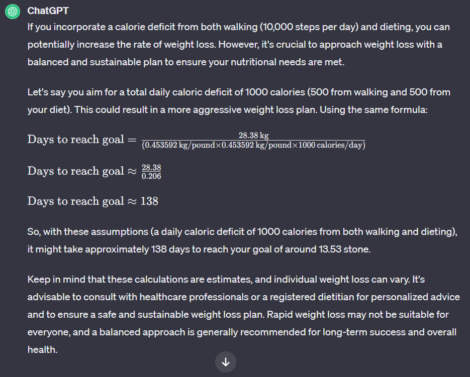
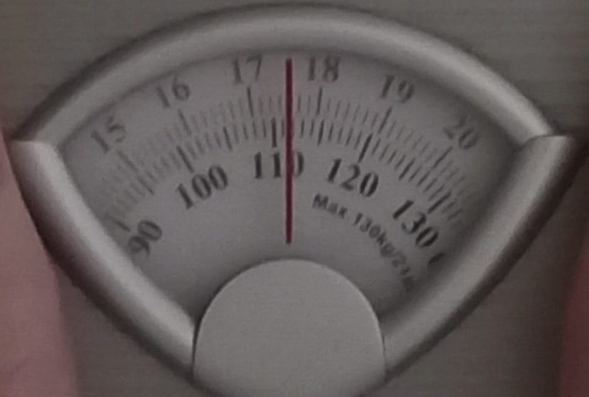

## Calculations

## Goal

> To be at a weight I am happy with, with defined muscles.

---

## SMART

1. **Specific:** `What do i want to accomplish?`

<!-- start of 'previous input' section -->

    
previous input

#
I aim to achieve a weight of 13.53 stone.

---

<!-- end of 'previous input' section -->

> I aim to achieve a weight i am happy with and i also aim to achieve muscle definition.

2. **Measurable:** `How will I know when it is accomplished?`

<!-- start of 'previous input' section -->

    
previous input

#
I will measure my progress using the metric of weight in stone.

---

<!-- end of 'previous input' section -->

> I will measure my progress by visually inspecting my body composition. I will do this by comparing visual changes in muscle definition, body shape, and overall appearance in the mirror every week.

3. **Achievable:** `How can the goal be accomplished?`
> The goal is realistic and achievable, balancing both dietary changes and physical activity to ensure a sustainable approach to weight loss. I will dedicate time for 10,000 steps a day and track my calories, ensuring i do not exceed 1500 calories per day. ~~(updated 12/04/24) If I can't get out the house due to insomnia i will do cardio workouts on youtube.~~ (updated 02/05/24) I now own a FITT Cube, it is great for taking 10,000 steps per day even with insomnia.

4. **Relevant:** `Does this seem worthwhile?`
> Weight loss is aligned with overall health improvement, including cardiovascular health, blood sugar control, joint health, and enhanced mental well-being.

5. **Time-bound:** `When can I accomplish this goal?`

<!-- start of 'previous input' section -->

    
previous input

#
> I plan to reach my goal in 138 days, by the 10th of April in the year 2024.

---

<!-- end of 'previous input' section -->

> I am extending this time-bound goal to the 10th of August.

---

## Progress

> 
Taken 24/11/2023

---

## Reflection

>
- In the furutre compensate days for recovery and illness. 
- Get flu vaccination in September each year.
- Fix insomnia problem.
- When awake at unsociable hours and can't walk outside, ~~do apartment friendly low impact cardio workouts at home.~~ use the FITT Cube.
- Don't soley rely on the BMI measurements as it doesn't distinguish between muscle and fat.
- Continue noticing visual changes and improvements. Once some muscles are defined and are to the desired standard, look for other muscles that need improving and then work on those.