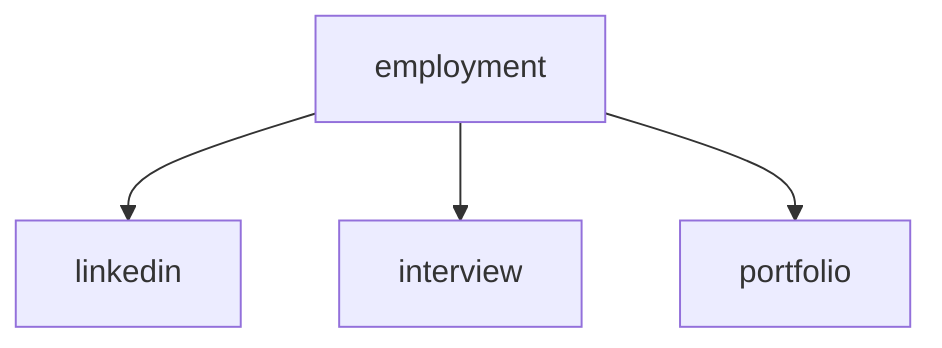
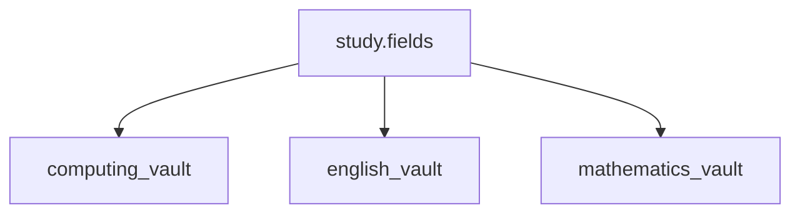

<!-- start of 'notes' section -->

    
Notes

## pipe operator:
- output from one command becomes input for the next.
- capable of stringing together multiple commands.

### input:
> |

#### example:
> get-service | out-file c:\services.txt 

Output from Get-Service is piped to Out-File, which will create a list of services in a text file.

---

## help:
In PowerShell, the Get-Help cmdlet is used to retrieve `information` **about** `cmdlets`, `functions`, `modules`, `scripts`, **and** other PowerShell `topics`. It provides you with detailed `documentation` **and** usage `examples` to help you understand how to use various PowerShell commands and features.

### input:
> get-help 

#### output:
screenshot

---

## commands:
desc

### input:

#### cmdlet:

> get-command

---

## aliases
dec

### input
> about_Aliases

---

<!-- end of 'notes' section -->

<!-- start of 'todo' section -->

    
Todo

#
1. [x] modify standards.dendron.md
    1. [x] use Markdown: Insert Link to File in Workspace for linking to root.md of a different vault
    1. [x] commit
1. [x] add pkbs to quick access in file explorer
1. [x] create new vault for computing
    1. [x] create vault with command
    1. [x] ensure new vault is not on .gitignore by default
    1. [x] move computing notes to new vault
    1. [x] refactor computing.
        1. [x] aliases
        1. [x] artificial-intelligence
        1. [x] command-line-interface
        1. [x] networking
        1. [x] programming
        1. [x] software
        1. [x] version-control-system
## employment vault

## multivault links

1. [x] check all notes and correct links in new vaults to date
    1. [x] update template
1. [x] move assets to their vaults to date
    1. [x] update template 
1. [x] Modify study.fields.md
    1. [x] link vaults
        1. [x] computing
        1. [x] english
        1. [x] mathematics
    1. [x] commit
1. [x] Modify study.fields.md
    1. [x] commit
1. [ ] create new vaults
    1. [x] computing
        1. [x] create vault with command
        1. [x] ensure new vault is not on .gitignore by default
        1. [x] move computing notes to new vault
        1. [x] refactor computing.
            1. [x] aliases
            1. [x] artificial-intelligence
            1. [x] command-line-interface
            1. [x] networking
            1. [x] programming
            1. [x] software
            1. [x] version-control-system
    1. [x] backlog
        1. [x] create vault with command
        1. [x] ensure new vault is not on .gitignore by default
        1. [x] commit (Add ___ vault)
        1. [x] modify root
        1. [x] move backlog notes to new vault
            1. [x] delete
                1. [x] backlog.tasks.completed.23.08.
                    1. [x] 02.md
                    1. [x] 03.md
            1. [x] modify personal-development.md 
                1. [x] link from here to root of backlog vault
        1. [x] commit
        1. [x] refactor backlog.
            1. [x] tasks
                1. [x] delete
                    1. [x] backlog.tasks.completed.23.07.
                        1. [x] 15.md
                        1. [x] 16.md
            1. [x] goals
                1. [x] delete backlog.md
        1. [x] commit
    1. [x] english
        1. [x] create vault with command
        1. [x] ensure new vault is not on .gitignore by default
        1. [x] commit (Add _ vault)
        1. [x] modify root
        1. [x] commit
        1. [x] move notes to new vault 
        1. [x] commit (Move _ notes to new vault)
        1. [x] refactor
            1. [x] delete english.md
        1. [x] commit (Refactor _ notes)
    1. [x] mathematics
        1. [x] create vault with command
        1. [x] ensure new vault is not on .gitignore by default
        1. [x] modify root
        1. [x] commit (Add _ vault)
        1. [x] move notes to new vault (Move _ notes to new vault)
            1. [x] delete network-models.md
            1. [x] fix broken links
                1. [x] optimization.flow.md
                1. [x] network-models.md
        1. [x] commit (Move _ notes to new vault)
        1. [x] refactor (Refactor _ notes)
            1. [x] delete 
                1. [x] graphs.types.md
                1. [x] network-models.optimization.md 
        1. [x] commit (Refactor _ notes)
    1. [x] study
        1. [x] create vault with command
        1. [x] ensure new vault is not on .gitignore by default
        1. [x] modify root
        1. [x] commit (Add _ vault)
        1. [x] move notes to new vault
        1. [x] commit (Move _ notes to new vault)
        1. [x] refactor
            1. [x] fix links
                1. [x] highlight-and-underlining.md
                1. [x] spaced-repetition.md
        1. [x] commit (Refactor _ notes)
    1. [x] exams
        1. [x] create vault with command
        1. [x] ensure new vault is not on .gitignore by default
        1. [x] delete new .gitignore in vault folder
        1. [x] modify root
        1. [x] commit (Add _ vault)
        1. [x] move notes to new vault (Move _ notes to new vault)
        1. [x] commit
        1. [x] refactor (Refactor _ notes)
            1. [x] delete exams.md
        1. [x] commit
        1. [x] check all notes and repair links if necessary
        1. [x] update assets folder if necessary
1. [x] personal development
    1. [x] create vault with command
    1. [x] ensure new vault is not on .gitignore (public) by default
    1. [x] delete new .gitignore in vault folder
    1. [x] modify root
    1. [x] commit (Add _ vault)
    1. [x] move notes to new vault (Move _ notes to new vault)
    1. [x] commit
    1. [x] refactor (Refactor _ notes)
        1. [x] delete personal-development.md
    1. [x] commit
    1. [x] check all notes and repair links
    1. [x] update assets folder if neccessary
1. [x] projects
    1. [x] create vault with command
    1. [x] ensure new vault is not on .gitignore by default
    1. [x] delete new .gitignore in vault folder
    1. [x] modify root
    1. [x] commit (Add _ vault)
    1. [x] move notes to new vault (Move _ notes to new vault)
    1. [x] commit
    1. [x] refactor (Refactor _ notes)
    1. [x] commit
    1. [x] check all notes and repair links
    1. [x] update assets folder if neccessary

1. [ ] scratch
    1. [x] create vault with command
    1. [x] ensure new vault is not on .gitignore by default
    1. [x] delete new .gitignore in vault folder
    1. [x] modify root
    1. [x] copy scratch.md to root.md
    1. [x] delete scratch.md
    1. [x] commit (Add _ vault)

1. [ ] standards
    1. [ ] create vault with command
    1. [ ] ensure new vault is not on .gitignore by default
    1. [ ] delete new .gitignore in vault folder
    1. [ ] modify root
    1. [ ] commit (Add _ vault)
    1. [ ] move notes to new vault (Move _ notes to new vault)
    1. [ ] commit
    1. [ ] refactor (Refactor _ notes)
        1. [ ] delete note.md
    1. [ ] commit
    1. [ ] check all notes and repair links
    1. [ ] update assets folder if neccessary

## template
1. [ ] backlog
    1. [ ] create vault with command
    1. [ ] ensure new vault is not on .gitignore by default
    1. [ ] modify root
    1. [ ] commit (Add _ vault)
    1. [ ] move notes to new vault (Move _ notes to new vault)
    1. [ ] commit
    1. [ ] refactor (Refactor _ notes)
        1. [ ] delete note.md
    1. [ ] commit
    1. [ ] check all notes and repair links
    1. [ ] update assets folder if neccessary

---

1. [ ] guide method
    1. [ ] insert command
    1. [ ] screenshot output
        1. [ ] rename
        1. [ ] move to assets\guides\powershell
        1. [ ] link image to note

1. [ ] learn (prioritise linkedin learning)
    1. [ ] powershell
    1. [ ] bash
    1. [ ] git-bash
    1. [ ] anaconda prompt

1. [ ] make aliases for shells
1. [ ] create anaconda environments for jupyter notebooks
    1. [ ] git-bash.ipynb
        1. [ ] edit commit message ae5335c, git commit refactor dendron.syntax (add .md)
    1. [ ] python.ipynb

## backlog
1. [ ] Research .NET objects in powershell for automation and system administration

---

<!-- end of 'todo' section -->