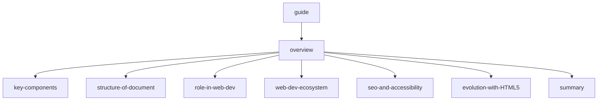

<!-- start of 'notes' section -->

    
Notes

#

---

<!-- end of 'notes' section -->

<!-- start of 'todo' section -->

    
Todo

#
1. [x] 08.md
    1. [x] add
    1. [x] modify
    1. [x] commit
1. [x] git push
1. [x] root.md
    1. [x] modify
    1. [x] commit
1. [x] git push
1. [ ] learn html
    1. [x] overview.md
        1. [x] add
        1. [x] modify
    1. [x] .key-components.md
        1. [x] add
        1. [x] modify
    1. [x] .structure-of-document.md
        1. [x] add
        1. [x] modify
    1. [x] .role-in-web-dev.md
        1. [x] add
        1. [x] modify
    1. [x] .web-dev-ecosystem.md
        1. [x] add
        1. [x] modify
    1. [x] .seo-and-accessibility.md
        1. [x] add
        1. [x] modify
    1. [x] .evolution-with-HTML5.md
        1. [x] add
        1. [x] modify
    1. [x] .summary.md
        1. [x] add
        1. [x] modify
    1. [x] commit
    1. [x] push
    1. [x] .key-components.md
        1. [x] modify
        1. [x] commit
    1. [x] .structure-of-document.md
        1. [x] modify
        1. [x] commit
    1. [x] guide.md and root.md
        1. [x] modify
        1. [x] commit
    1. [x] git push 
    1. [x] text-markup.md
    1. [x] links-and-navigation.md
    1. [x] images.md
    1. [x] forms.md
    1. [] commit
    
---

<!-- end of 'todo' section -->