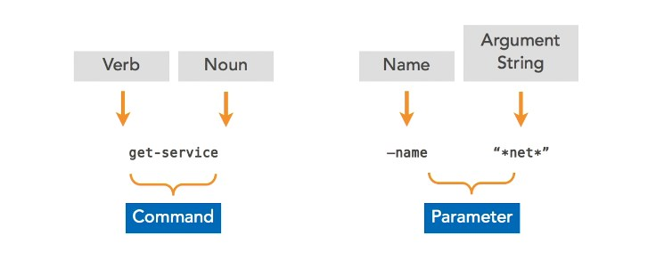
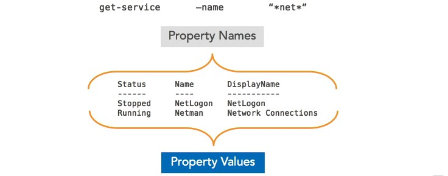
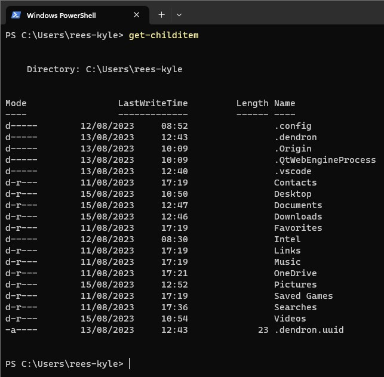

<!-- start of 'syntax' section -->

    
Syntax

#
Powershell is mostly `singular` **and** `case insensitive`. You can use `TAB` **to** `autocomplete` commands.

### Input
> 

### Output
> 

---

<!-- end of 'syntax' section -->

<!-- top of 'show directory' section -->

    
Show Directory

#
In PowerShell, the Get-ChildItem cmdlet is used to `retrieve` a `list` **of** `child items` **within** a specified `directory`. Child items **can include** `files`, `directories`, and other `objects` within the specified directory.

### Input

#### Cmdlet
> `Get-ChildItem`

#### Aliases
> `ls`

> `dir`

> `gci`

### Output
> 

---

<!-- end of 'show directory' section -->

<!-- start of 'example' section -->

    
Example

#
Description

### Input
>
input

### Output
>
output

---

<!-- end of 'example' section -->