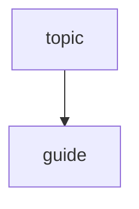
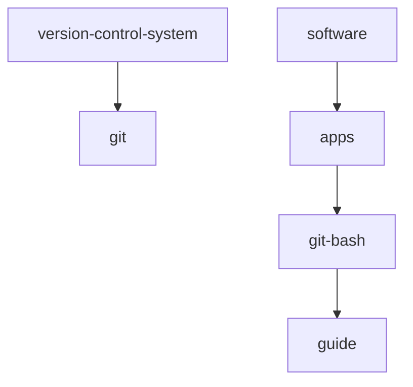

1. [x] place both repos in one drive 
1. [x] untrack scratch.md for both private and public repos
    1. [x] private
        1. [x] add scratch.md to .gitignore
        1. [x] remove scratch.md from index
    1. [x] public
        1. [x] add scratch.md to .gitignore
        1. [x] remove scratch.md from index
1. [x] add standards.backlog.md
1. [x] modify backlog.md
## hierarchy

1. [x] rename syntax.md to guide.md
1. [x] modify guide.md
    1. [x] when renaming a note that has a parent use Dendron: Refactor Hierarchy command
    1. [x] flow chart
## hierarchy

1. [x] add version-control-system.md
1. [x] modify version-control-system.md
1. [x] add version-control-system.git.md
1. [x] modify version-control-system.git.md
1. [x] add git-bash.md
1. [x] modify git-bash.md
1. [x] add git-bash.guide.md
1. [x] modify git-bash.guide.md (To stop tracking a file, we must remove it from the index:
git rm --cached file.ext)