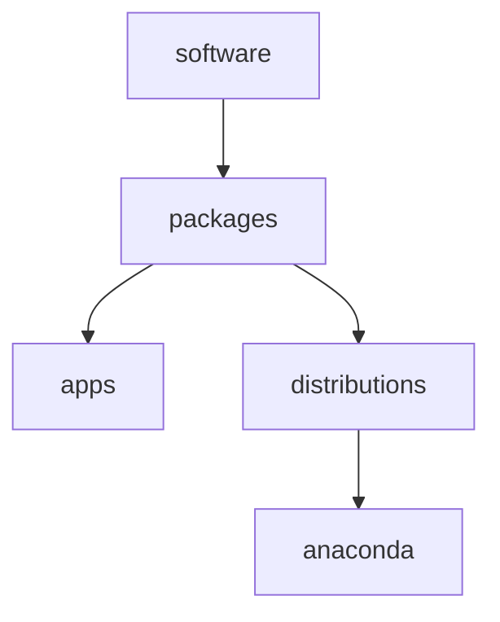

1. [x] research anaconda

1. [x] hierarchy
    1. [x] refactor software.apps to software.packages.apps
    1. [x] software.md
        1. [x] add
        1. [x] modify 
    1. [x] apps.md
        1. [x] add
        1. [x] modify 
    1. [x] packages.md
        1. [x] add
        1. [x] modify
    1. [x] packages.distributions.md
        1. [x] add
        1. [x] modify
    1. [x] distributions.anaconda.md
        1. [x] add
        1. [x] modify
1. [x] setup anaconda 
    1. [x] install anaconda
    1. [x] anaconda promt
        1. [x] conda install ipykernel
    1. [x] vscode
        1. [x] select interpreter ('base': conda)