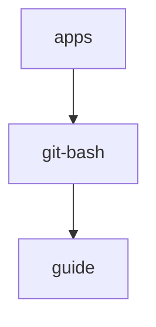
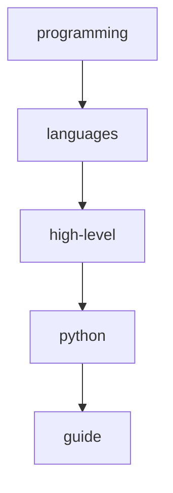
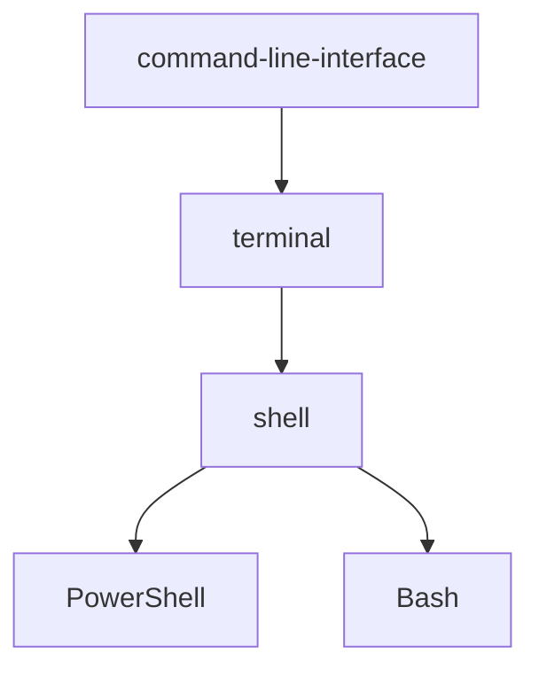

1. [x] delete old guides and create standard for creating guides in dendron
    1. [x] delete old guides
        1. [x] delete git-bash.guide.md
        1. [x] delete dendron.guide.md
    1. [x] Modify standards.dendron.md
1. [x] guide hierarchies

1. [x] create guide using jupyter notebook
    1. [x] git-bash
        1. [x] add apps.git-bash.guide.md
        1. [x] add git-bash.ipynb
        1. [x] link note to jupyter notebook
    1. [x] python
        1. [x] add programming.languages.high-level.python.guide.md
        1. [x] add python.ipynb
        1. [x] link note to jupyter notebook
1. [x] command-line interface hierarchy

1. [x] add
    1. [x] command-line-interface.md
        1. [x] command-line-interface.terminal.md
            1. [x] command-line-interface.terminal.shell.md
                1. [x] command-line-interface.terminal.shell.powershell.md
                1. [x] command-line-interface.terminal.shell.bash.md
1. [x] modify
    1. [x] command-line-interface.md
        1. [x] command-line-interface.terminal.md
            1. [x] command-line-interface.terminal.shell.md
                1. [x] command-line-interface.terminal.shell.powershell.md
                1. [x] command-line-interface.terminal.shell.bash.md
1. [x] add 17.md
1. [x] modify 17.md