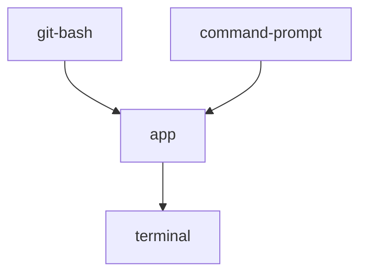
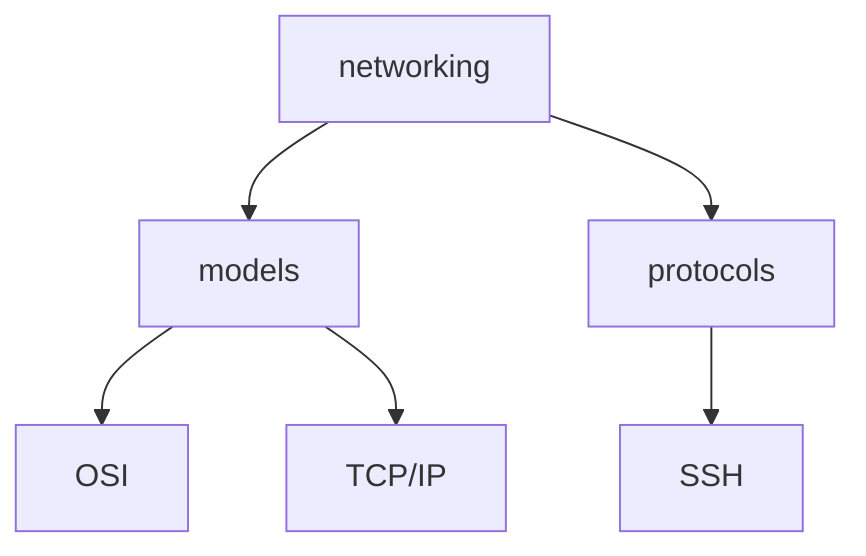
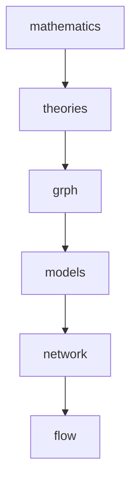
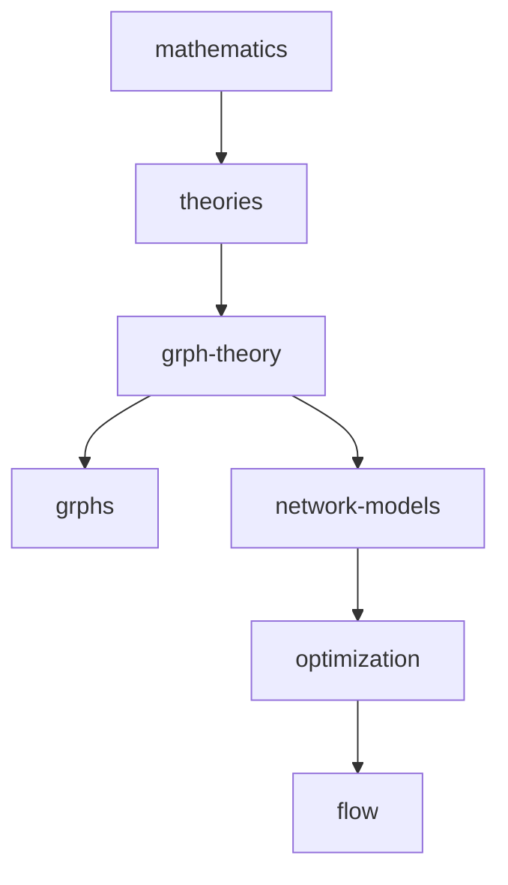
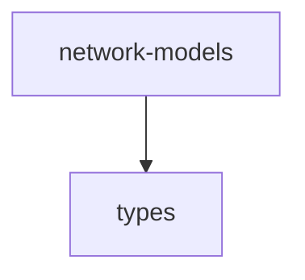
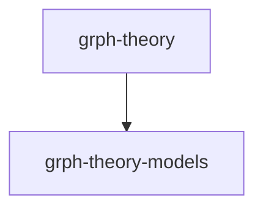
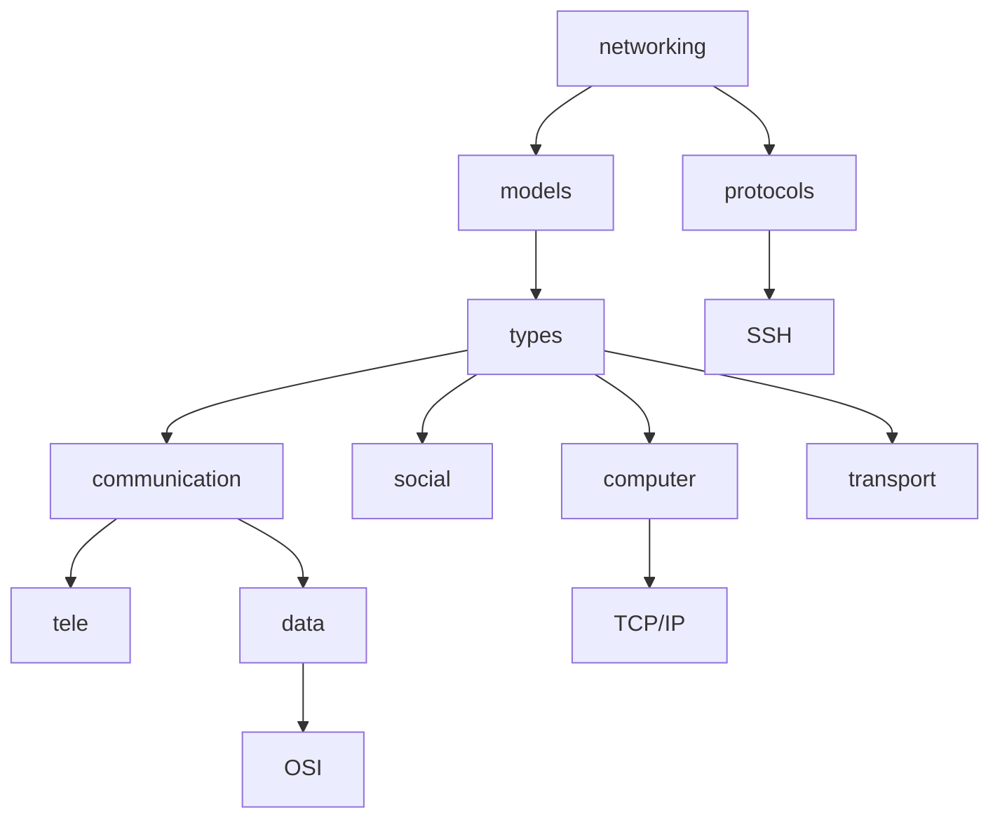
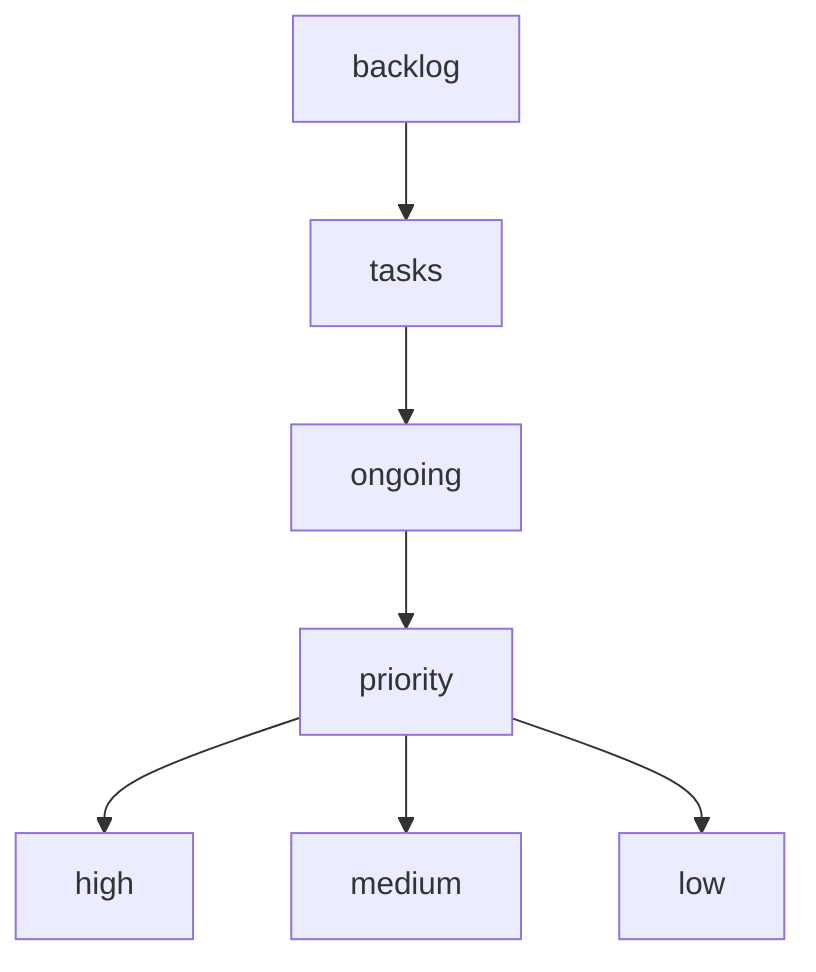
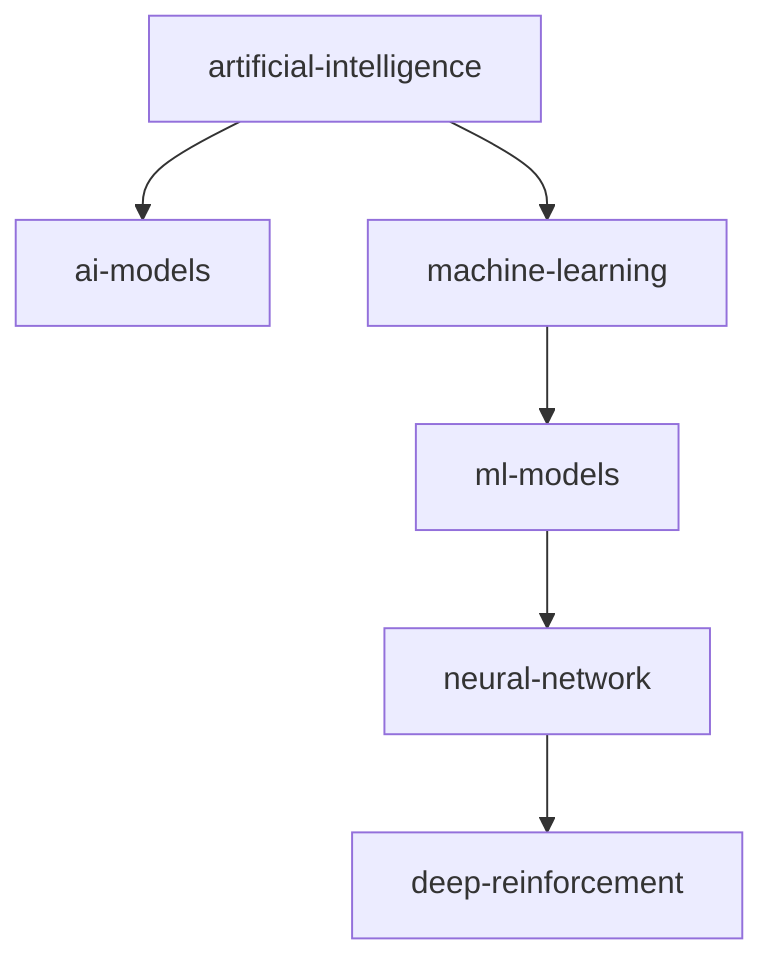

## apps that provide terminals

1. [x] link apps.git-bash.md and apps.command-prompt.md to command-line-interface.terminal.md
    1. [x] apps.command-prompt.md
        1. [x] add
        1. [x] modify
    1. links
        1. [x] apps.git-bash.md to command-line-interface.terminal.md
        1. [x] apps.command-prompt.md to command-line-interface.terminal.md
1. [x] edit title in powershell.md
1. [x] link apps.command-prompt.md to powershell.md
## networking hierarchy (changes)

1. [x] add
    1. [x] networking.md
        1. [x] networking.models.md
            1. [x] networking.models.osi.md
            1. [x] networking.models.tcp-over-ip.md
        1. [x] networking.protocols.md
            1. [x] networking.protocols.ssh.md
## graph theory hierarchy (changes)

1. [x] add
    1. [x] mathematics.md
    1. [x] mathematics.theories.md
    1. [x] mathematics.theories.graph.md
    1. [x] mathematics.theories.graph.models.md
    1. [x] mathematics.theories.graph.models.network.md
    1. [x] mathematics.theories.graph.models.network.flow.md
1. [x] refactor mathematics.md to study.fields.mathematics.md
1. [x] modify
    1. [x] mathematics.md
    1. [x] mathematics.theories.md
    1. [x] mathematics.theories.graph.md
    1. [x] mathematics.theories.graph.models.md
1. [x] delete 
    1. [x] models.network.md
    1. [x] network.flow.md
1. [x] graph.models.md
    1. [x] rename to graph.graphs.md
    1. [x] delete content
    1. [x] modify

**new graph theory hierarchy**

1. [x] add
    1. [x] network-models.md
    1. [x] optimization.md
    1. [x] flow.md
1. [x] write two network model documents for both areas:
    1. [x] mathematics
    1. [x] networking

1. [x] graph.theory-models.md
    1. [x] add
    1. [x] modify
1. [x] networking.models.types.md
    1. [x] add
    1. [x] modify
        1. [x] link to graph.theory-models.md
1. [x] paste text from documents into 
    1. [x] networking.models.md
    1. [x] mathematics.theories.graph.network-models.md
1. [x] graphs.types.md
    1. [x] add
    1. [x] modify
    1. [x] cross reference graphs.md to avoid duplicate info
1. [x] link from theory-models.md to graphs.types.md
1. [x] modify
    1. [x] network-models.md
    1. [x] optimization.md
    1. [x] flow.md
1. [x] graphs.md
    1. [x] modify
    1. [x] link from graphs.md to graph.network-models.md
## new info
1. [x] add following to notes where appropriate
    1. [x] modelling = `use of theory`
## new networking hierarchy

1. [x] add models.types.
    1. [x] communication.tele.md
    1. [x] communication.data.md
    1. [x] social.md
    1. [x] computer.md
    1. [x] transport.md
1. [x] refactor 
    1. [x] models.osi.md to models.types.communication.data.osi.md
    1. [x] models.tcp-over-ip.md to models.types.computer.tcp-over-ip.md
## backlog priority levels hierarchy

1. [x] add priority levels to ongoing.md
    1. [x] add priority.critical.md
    1. [x] add priority.high.md
    1. [x] add priority.medium.md
    1. [x] add priority.low.md
## neural network model hierarchy

1. [x] refactor the following to computing.md
    1. [x] command-line-interface.md
    1. [x] networking.md
    1. [x] programming.md
    1. [x] software.md
    1. [x] version-control-system.md
1. [x] refactor continuous-learning.techniques.md to study.techniques.md