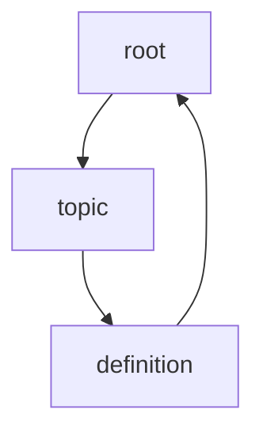

## my learning methodology

- learning a topic that comes to mind. working from the root. (idea)
- exploring a keyword within the topic. branching out. (definition)
- establishing the hierarchal structure, working backwards from keyword. working toward the root. (origin)
- forming upside down triangle.
1. [ ] platforms.social-media.md
1. [ ] thought-leadership.md
1. [ ] link from linkedin.md to thought-leadership.md
1. [ ] Add network.md
1. [ ] modify models.types.
    1. [ ] communication.tele.md
    1. [ ] communication.data.md
    1. [ ] social.md
    1. [ ] computer.md
    1. [ ] transport.md
1. [ ] modify computing.
    1. [ ] artificial-intelligence.models.md
    1. [ ] artificial-intelligence.machine-learning.models.neural-network.deep-reinforcement.md
    1. [ ] networking.protocols.md
    1. [ ] networking.protocols.ssh.md
1. [ ] research the capability of shell scripts
1. [ ] courses on anaconda
    1. [ ] data visualisation
    1. [ ] machine learning