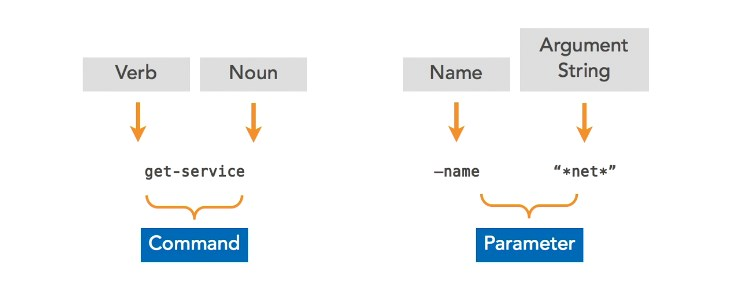
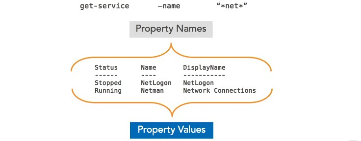
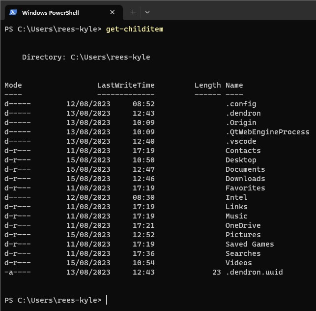

<!-- start of 'syntax' section -->

    
Syntax

#
Powershell is `case insensitive`.

### Input
>

### Output
>

---

<!-- end of 'syntax' section -->

<!-- top of 'list directory' section -->

    
List Directory

#
In PowerShell, the Get-ChildItem cmdlet is used to `retrieve` a `list` **of** `child items` **within** a specified `directory`. Child items **can include** `files`, `directories`, and other `objects` within the specified directory.

### Input
>
`Get-ChildItem`

### Output
>

---

<!-- end of 'list directory' section -->

<!-- start of 'example' section -->

    
example

#
description

### Input
>
input

### Output
>
output

---

<!-- end of 'example' section -->