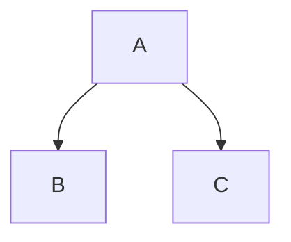

## Create Folded Section

    
Click here to view folded section!

### Folded Section
You are now viewing the folded section.

---

## White space

From here
# 
to here.

---

## Rename note

VSCode cmd = `Dendron: Rename Note` (notes that **do not have** a **parent**)

VSCode cmd = `Dendron: Refactor Hierarchy` (notes that **have** a **parent**)

---

## Flow chart

